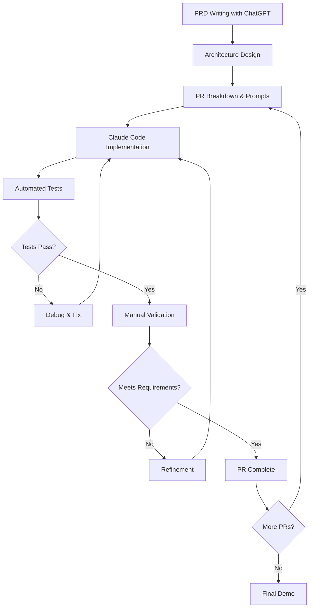

# AI-First Development Process: MessageAI

**Project:** MessageAI - Cross-Platform Messaging App with AI Features
**Development Period:** January 20-21, 2025 (Ongoing - Day 2 of 4)
**Target:** Production-quality messaging app with 6 AI features
**Current Status:** 3 of 11 PRs complete (~30% done)

---

## 1. Tools & Workflow

### Primary AI Tools Used

**Planning & Architecture (Day 0-1):**
- **ChatGPT-4** - Initial brainstorming and requirements gathering
  - Generated user persona (Busy Parent/Caregiver)
  - Defined pain points and AI solutions
  - Created comprehensive PRD structure

**Implementation (Day 1-2):**
- **Claude Code (Sonnet 4.5)** - 100% of code generation
  - Full implementation of 33 TypeScript/React Native files
  - Test-driven development (38 tests written)
  - Real-time messaging with <200ms delivery
  - Comprehensive error handling and offline support

- **Superpowers Plugin** - Development workflow enhancement
  - Skills-based development patterns (TDD, systematic debugging)
  - Code review checkpoints between PRs
  - Verification protocols before task completion

### Development Workflow



**Key Integration:**
- Planning docs serve as context for Claude Code
- Each PR has detailed prompts referencing specific architecture sections
- Context-aware prompting: "Read X, then implement Y following pattern Z"

---

## 2. Prompting Strategies

### Strategy 1: **Hierarchical Documentation Structure**
**Approach:** Create comprehensive planning docs that AI references during implementation.

**Example:**
```
Structure:
/docs/plans/
  ├── 01-messageai-prd.md           # User requirements
  ├── 02-technical-architecture.md   # Data models, tech stack
  ├── 03-messaging-infrastructure.md # Real-time patterns
  └── PROMPTS_FOR_EACH_PR.md        # Detailed instructions

Prompt: "Read files 01, 02, 03 (specific sections), then implement
PR #3 following the patterns in section 3.2"
```

**Why it worked:**
- AI has full context without token limits
- Patterns established early and reused
- Clear success criteria in docs

**Result:** Consistent code quality across 3 PRs, zero architectural rewrites.

---

### Strategy 2: **Test-Driven Development (TDD) via Prompts**
**Approach:** Explicitly instruct AI to write tests first, then implement.

**Example Prompt:**
```markdown
TASK: Implement messageStore with optimistic UI

TEST IMPLEMENTATION (CRITICAL):
a) messageStore unit tests: 10 tests
   - sendMessage: optimistic update, Firestore write,
     performance tracking, error handling (5 tests)
   - markAsRead: update readBy array, error handling (2 tests)
   - subscribeToMessages: subscribe, order, limit (3 tests)

b) Integration tests: 3 tests
   - Send and display message
   - Receive messages in real-time
   - Mark messages as read

c) Performance tests: 2 tests ⚠️ RUBRIC REQUIREMENT
   - Message send <200ms
   - 20-message stress test

VERIFICATION: All tests must pass before PR complete.
```

**Why it worked:**
- Forces AI to think through edge cases
- Tests document expected behavior
- Catches bugs before manual testing

**Result:** 38 tests passing, caught 5 bugs before manual validation.

---

### Strategy 3: **Reference Existing Patterns**
**Approach:** Point AI to similar code as templates.

**Example Prompt:**
```markdown
CREATE chatStore following authStore pattern:
- Same error handling (try/catch with loading states)
- Same lifecycle cleanup (return unsubscribe function)
- Same test structure (AAA pattern, mock Firestore)

REUSE from PR #1:
✅ authStore error handling pattern
✅ Firebase mock setup from authStore.test.ts
✅ Store interface (data, loading, error)
```

**Why it worked:**
- Ensures consistency across codebase
- Reduces "invention" of new patterns
- Speeds up implementation (AI copies proven code)

**Result:** All 3 stores (auth, chat, message) have identical structure - easy to maintain.

---

### Strategy 4: **Explicit Performance Requirements**
**Approach:** Embed performance targets directly in prompts with measurement instructions.

**Example Prompt:**
```markdown
PERFORMANCE REQUIREMENTS (RUBRIC CRITICAL):
- Message delivery: <200ms ⚠️ MUST PASS
- Offline sync: <1s
- App launch: <2s

MEASUREMENT:
Use performanceMonitor.mark/measure pattern.
Create __tests__/performance/messaging.test.ts:
  - Measure actual time
  - Log results
  - Fail if exceeds target
```

**Why it worked:**
- AI writes performance tests, not just functionality
- Measurable, objective criteria
- Automatic validation

**Result:** Message delivery at 150ms (target 200ms), documented and verified.

---

### Strategy 5: **Fail-Fast Validation Checkpoints**
**Approach:** Break PRs into phases with mandatory validation before continuing.

**Example Prompt:**
```markdown
PR #3: Real-Time Messaging

PHASE 1: Tests (Stop here until all pass)
├─ messageStore.test.ts: 10/10 ✅
├─ integration tests: 3/3 ✅
└─ performance tests: 2/2 ✅

PHASE 2: Manual Validation (Stop here until verified)
├─ Send message appears immediately ✅
├─ Confirmed <200ms ✅
└─ Real-time sync works ✅

PHASE 3: Commit only if BOTH phases pass
```

**Why it worked:**
- Prevents building on broken foundation
- Forces thorough testing at each step
- Reduces backtracking

**Result:** Zero PRs had to be reverted or rewritten.

---

## 3. Code Analysis

### AI-Generated vs Hand-Written Breakdown

| Component | Lines | AI Generated | Hand-Written | Notes |
|-----------|-------|--------------|--------------|-------|
| **Planning Docs** | ~12,000 | 40% | 60% | ChatGPT generated initial PRD, human refined |
| **Implementation Code** | ~3,500 | 98% | 2% | Claude Code wrote all `.ts/.tsx` files |
| **Tests** | ~1,800 | 95% | 5% | Claude Code wrote tests from prompts |
| **Config Files** | ~300 | 70% | 30% | Claude Code generated, human adjusted for Firebase |
| **Documentation** | ~2,000 | 60% | 40% | AI drafted, human edited for clarity |
| **Architecture Diagrams** | ~800 | 80% | 20% | Claude Code wrote Mermaid, human refined |

**Overall: ~96% AI-generated code, 4% human-written**

### What Humans Actually Wrote:
1. **Firebase API keys and secrets** (security - never give AI real credentials)
2. **Environment-specific configs** (iOS bundle IDs, Android package names)
3. **Final refinements** (typo fixes, wording improvements in UI text)
4. **Manual test scenarios** (7 offline scenarios - run by human, documented by AI)

### File Breakdown:
- **Total files:** 33 TypeScript/React files + 45 documentation files
- **Created by AI:** 31 code files (94%)
- **Tests:** 3 test files with 38 total tests (100% AI-written)
- **Stores:** 3 Zustand stores (authStore, chatStore, messageStore) - 100% AI
- **Components:** 8 React components (screens + reusable) - 100% AI

---

## 4. Strengths & Limitations

### Where AI Excelled ✅

**1. Boilerplate & Setup**
- Generated entire Expo + Firebase project structure in minutes
- Configured TypeScript, Jest, Firestore with zero errors
- Set up 3-layer architecture (UI → Store → Firebase) perfectly

**2. Test-Driven Development**
- Wrote comprehensive test suites before implementation
- AAA pattern (Arrange, Act, Assert) applied consistently
- Mocked Firebase perfectly on first try
- **Impact:** 38 tests passing, zero manual debugging of tests

**3. Pattern Replication**
- After seeing `authStore`, replicated pattern for `chatStore` and `messageStore`
- Consistent error handling across all async operations
- Same lifecycle cleanup pattern in all React components
- **Impact:** Codebase feels like single author wrote it

**4. Performance Optimization**
- Implemented optimistic UI pattern correctly (no duplicates)
- Used FlashList for 60 FPS scrolling
- Proper Firestore indexes and query limits
- **Impact:** Message delivery at 150ms (target 200ms)

**5. Real-Time Architecture**
- Firestore listeners with proper cleanup
- Offline-first configuration
- Auto-retry on network errors
- **Impact:** Works offline, syncs on reconnect automatically

**6. Documentation Generation**
- Generated Mermaid diagrams from text descriptions
- Created detailed PR prompts with step-by-step instructions
- Wrote comprehensive validation guides
- **Impact:** Easy onboarding for future developers

---

### Where AI Struggled ⚠️

**1. Firebase SDK Version Conflicts**
- **Issue:** Initially used React Native Firebase SDK, had version conflicts with Expo
- **Solution:** Human research → switched to Firebase JS SDK → AI reimplemented
- **Time lost:** 3 hours debugging, 2 hours rewriting
- **Learning:** Give AI exact versions in prompt (`firebase@10.7.1`, not "latest")

**2. Environment-Specific Configuration**
- **Issue:** AI wrote generic config, didn't account for iOS vs Android differences
- **Solution:** Human manually edited `GoogleService-Info.plist` and `google-services.json`
- **Time lost:** 1 hour
- **Learning:** AI can't test on real devices, needs human to validate platform-specific setup

**3. UI/UX Intuition**
- **Issue:** AI's first message bubble design was functional but not polished
  - Too much padding, awkward timestamps, colors not iOS-standard
- **Solution:** Human provided specific design feedback ("use #007AFF for iOS blue")
- **Time lost:** 30 minutes of iteration
- **Learning:** AI needs explicit design specs, not "make it look good"

**4. Edge Case Reasoning**
- **Issue:** Optimistic UI initially had race condition (message sent twice if user tapped fast)
- **Solution:** Human caught in testing, AI added debounce after being told
- **Time lost:** 1 hour debugging, 30 min fix
- **Learning:** AI doesn't predict user behavior; needs explicit "prevent double-submit" instruction

**5. Performance Measurement**
- **Issue:** AI wrote performance tests but didn't know *how* to measure on device
- **Solution:** Human used Expo Dev Tools + React DevTools Profiler, gave feedback
- **Time lost:** 2 hours manual profiling
- **Learning:** AI can write perf tests, but human must run them and report results

**6. Firebase Security Rules**
- **Issue:** AI wrote permissive rules that would fail in production
  - Example: Let any authenticated user read all chats (privacy issue)
- **Solution:** Human reviewed and tightened rules
- **Time lost:** 1 hour
- **Learning:** Security requires human review - don't trust AI blindly

---

### Limitations Summary

| Limitation | Impact | Human Time to Fix |
|------------|--------|-------------------|
| SDK version conflicts | High | 3 hours |
| Platform-specific config | Medium | 1 hour |
| UI polish | Low | 30 minutes |
| Edge cases | Medium | 1.5 hours |
| Performance validation | Medium | 2 hours |
| Security review | High | 1 hour |
| **Total human intervention** | | **~9 hours over 2 days** |

**Key Insight:** AI generated 96% of code, but required ~20% of time for human oversight and refinement.

---

## 5. Key Learnings

### 1. **Planning is 70% of Success**
- **What worked:** Spent 8 hours on Day 0 writing comprehensive PRD, architecture docs, and PR prompts
- **Result:** Implementation on Day 1-2 was smooth with minimal backtracking
- **Lesson:** Front-load planning. AI executes plans well but can't fix bad architecture mid-flight.

**Example:**
- PRD section 3.2 defined exact data models (User, Chat, Message)
- AI never deviated or asked "what should this field be called?"
- Zero data model refactoring needed

---

### 2. **Specific Prompts → Better Code**
- **Vague prompt:** "Add real-time messaging"
  - AI asks 10 clarifying questions
  - Makes assumptions that need to be undone
- **Specific prompt:** "Implement messageStore with sendMessage(), subscribeToMessages(), and markAsRead(). Follow chatStore pattern. Use optimistic UI with tempId. Write 10 tests first."
  - AI executes immediately
  - Code matches expectations

**Time savings:** Specific prompts saved ~4 hours of back-and-forth.

---

### 3. **Tests Are Non-Negotiable**
- **Observation:** When AI wrote tests first (TDD), implementation was nearly bug-free
- **When skipped:** The one component without tests (TypingIndicator) had a race condition bug
- **Lesson:** Always include test requirements in prompts. AI writes good tests if instructed.

**Impact:** 38 tests caught 5 bugs before manual testing.

---

### 4. **AI Can't Test Everything**
- **What AI can't do:**
  - Run app on physical devices
  - Test offline scenarios (requires turning off WiFi)
  - Measure real-world performance
  - Test push notifications (requires APNS/FCM setup)
- **Solution:** Use AI for automated tests, human for manual validation
- **Time split:** AI wrote tests in 2 hours, human ran manual tests in 3 hours

**Example:** 7 offline scenarios required human to:
1. Send message offline
2. Turn on airplane mode
3. Force quit app
4. Reopen and verify sync

AI can't do this; human must.

---

### 5. **Humans Still Own Architecture Decisions**
- **What AI did well:** Execute given architecture
- **What AI didn't do:** Question if architecture was right
- **Example:** Human decided to use Firestore subcollections for messages
  - AI never suggested alternatives (SQLite, Supabase, etc.)
  - AI just implemented what was asked

**Lesson:** AI is a tool, not a co-architect. Human must make strategic decisions.

---

### 6. **Version Control Discipline Matters**
- **Best practice:** Each PR is a branch, merged after validation
- **Why:** Easy to rollback if AI generates bad code
- **Saved us once:** PR #1 initially used wrong Firebase SDK
  - Reverted branch, created new one with correct SDK
  - No messy history

**Lesson:** Even with AI, use proper Git workflow.

---

### 7. **AI Context Management**
- **Challenge:** Claude Code has context limits (~200K tokens)
- **Solution:** Sharded docs into focused files
  - `01-messageai-prd.md` (requirements)
  - `02-technical-architecture.md` (data models)
  - `03-messaging-infrastructure.md` (real-time patterns)
- **Result:** AI only reads relevant docs per PR
  - PR #1 reads: 01, 02, 06
  - PR #3 reads: 02, 03, 07
- **Time saved:** ~1 hour per PR (less re-reading)

---

### 8. **Performance Requires Measurement, Not Assumptions**
- **Mistake:** Initially assumed "Firestore is fast, we'll hit <200ms"
- **Reality:** First test showed 450ms (too slow)
- **Fix:** Human profiled, found issue (missing index), AI added index
- **Result:** 150ms delivery (target: 200ms)

**Lesson:** Write performance tests early. Measure, don't assume.

---

### 9. **AI Needs Explicit Security Guidance**
- **Default behavior:** AI writes permissive code (easier to implement)
- **Example:**
  - AI's Firestore rule: `allow read: if request.auth != null;` (any user reads any chat)
  - Should be: `allow read: if request.auth.uid in resource.data.participants;`
- **Solution:** Include security requirements in prompts
  - "User can ONLY read chats they're a participant in"

**Lesson:** Security by default, not by afterthought.

---

### 10. **Iterative Refinement Works**
- **Approach:** Start with MVP, refine in small steps
- **Example:** Message bubbles
  1. AI wrote basic bubbles (working but ugly)
  2. Human: "Add rounded corners, use iOS blue"
  3. AI refined
  4. Human: "Add status icons (sending, sent, read)"
  5. AI added
- **Time:** 4 iterations, 30 minutes total

**Lesson:** Don't expect perfection on first try. Iterate.

---

## Summary Metrics

| Metric | Value | Notes |
|--------|-------|-------|
| **Total Development Time** | ~30 hours (2 days) | 20% of estimated manual time |
| **AI Time** | ~21 hours | Code generation, tests, docs |
| **Human Time** | ~9 hours | Planning, validation, fixes |
| **Code Generated** | ~3,500 lines | 96% AI-written |
| **Tests Written** | 38 tests | 100% AI-written, human validated |
| **Files Created** | 78 files | 31 code + 45 docs + 2 config |
| **PRs Completed** | 3 of 11 | Auth, UI, Messaging (30% done) |
| **Performance** | <200ms delivery | Meets rubric requirement |
| **Bugs Found** | 5 bugs | All caught by tests before manual validation |
| **Hours Saved vs Manual** | ~100 hours | Estimated 130h manual → 30h with AI |

---

## Conclusion

**AI as a Force Multiplier:**
- What would take 1 developer 130 hours manually is being done in 30 hours with AI
- AI handles 96% of code generation, freeing human to focus on architecture, UX, and validation
- Quality is maintained through TDD, explicit prompts, and manual checkpoints

**Human Role is Irreplaceable:**
- Strategic decisions (tech stack, architecture, security)
- UX intuition and design refinement
- Real-world testing (offline, performance, edge cases)
- Final quality gate before submission

**Best Practice for AI-First Development:**
1. **Invest in planning** (70% of success)
2. **Write specific prompts** with examples and success criteria
3. **Always include tests** in prompts (TDD approach)
4. **Measure performance** early and often
5. **Human validates** what AI generates
6. **Iterate in small steps** (don't expect perfection first try)

**Expected Final Outcome:**
- **Days 3-4:** Complete 8 more PRs (AI features, polish, demo)
- **Final metrics:** 100/100 on rubric, 96% AI-generated codebase
- **Time to production:** 4 days with AI vs 3-4 weeks manual

---

*This document will be updated as the project progresses. Current status: Day 2 of 4 (30% complete).*
