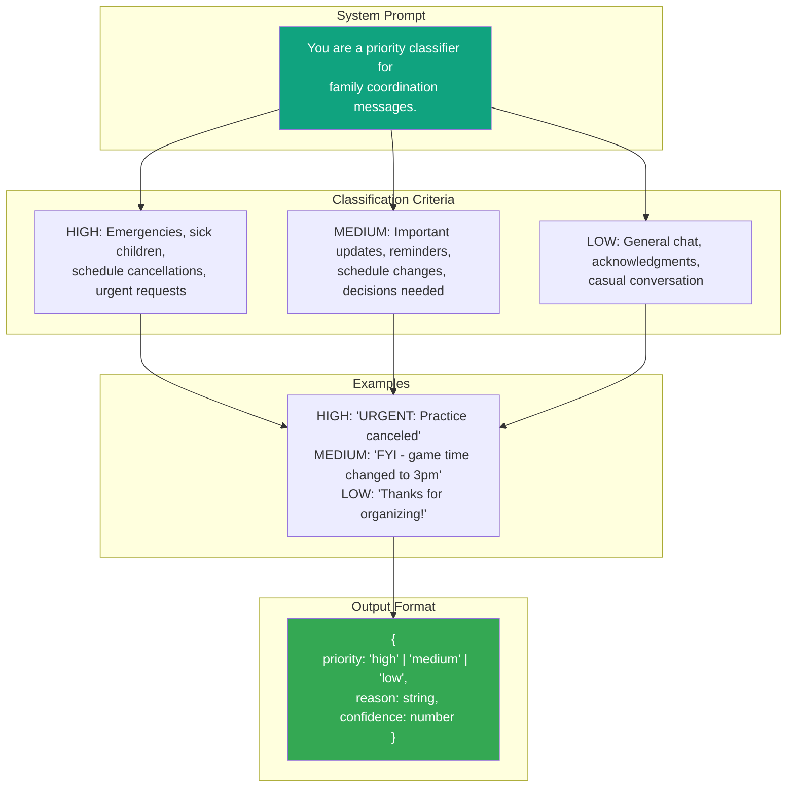

# MessageAI - AI Processing Pipeline Diagrams

## AI Feature Overview


## AI Processing Architecture


## AI Feature: Calendar Extraction


## Calendar Extraction Function Call Schema


## AI Feature: Decision Summarization


## Decision Summary JSON Schema


## AI Feature: Priority Detection


## Priority Detection Prompt



## AI Feature: RSVP Tracking

```mermaid
sequenceDiagram
    participant Sarah
    participant CloudFunction
    participant OpenAI
    participant Firestore
    participant GroupMembers

    Sarah->>Firestore: "Who's coming to the party Saturday?"

    Firestore->>CloudFunction: onCreate trigger

    CloudFunction->>Firestore: Fetch recent messages

    Firestore-->>CloudFunction: Last 20 messages

    CloudFunction->>OpenAI: Extract RSVP responses<br/>Function calling

    Note over OpenAI: Analyzes messages:<br/>"I'm in!" - John<br/>"Can't make it" - Emma<br/>"Maybe, depends on work" - Mike

    OpenAI-->>CloudFunction: {<br/>  responses: {<br/>    john_id: 'yes',<br/>    emma_id: 'no',<br/>    mike_id: 'maybe'<br/>  }<br/>}

    CloudFunction->>CloudFunction: Calculate summary

    CloudFunction->>Firestore: Update aiExtraction.rsvp

    Firestore->>GroupMembers: Real-time update

    GroupMembers->>GroupMembers: Display RSVP card:<br/>✓ 1 Yes | ✗ 1 No | ? 1 Maybe
```



## RSVP Tracking Data Flow


## AI Feature: Deadline Extraction

```mermaid
graph TB
    Start([Message: Permission slip<br/>due Friday]) --> Trigger[Cloud Function triggered]

    Trigger --> Extract[Extract text]
    Extract --> Send[Send to OpenAI<br/>Function calling]

    Send --> Analyze[GPT-4 identifies:<br/>- Task: Permission slip<br/>- Due: Friday<br/>- Priority: medium]

    Analyze --> Convert[Convert relative date<br/>Friday → 2025-01-24]

    Convert --> Calculate[Calculate reminder time<br/>Due date - 24 hours]

    Calculate --> Store[Store in Firestore:<br/>aiExtraction.deadlines[]]

    Store --> Schedule[Schedule reminder notification]

    Schedule --> Listen[Client listener updates]

    Listen --> Display[Show in Deadlines tab]

    Display --> Notify{Due date<br/>approaching?}

    Notify -->|Yes| Push[Send push notification:<br/>"Reminder: Permission slip due tomorrow"]
    Notify -->|No| Display

    style Analyze fill:#10a37f,color:#fff
    style Push fill:#f9ab00,color:#000
```

## Deadline Extraction Function


## AI Feature: Proactive Assistant (Advanced)

```mermaid
sequenceDiagram
    participant User
    participant CloudFunction
    participant LangChain
    participant RAG as RAG Pipeline
    participant OpenAI
    participant Firestore

    User->>Firestore: "Soccer at 3pm Saturday"

    Firestore->>CloudFunction: onCreate trigger

    CloudFunction->>RAG: Retrieve user's calendar events

    RAG-->>CloudFunction: Existing events:<br/>["Birthday party 2pm Saturday"]

    CloudFunction->>LangChain: Initialize agent<br/>Context: New event + Existing events

    LangChain->>LangChain: Step 1: Detect conflict<br/>Soccer 3pm overlaps party 2pm

    LangChain->>OpenAI: Generate alternatives<br/>Prompt: "Suggest alternative times"

    OpenAI-->>LangChain: Suggestions:<br/>- Sunday 3pm<br/>- Saturday 5pm (after party)

    LangChain->>CloudFunction: Agent result:<br/>{<br/>  conflict: true,<br/>  conflictsWith: "Birthday party",<br/>  suggestions: [...]<br/>}

    CloudFunction->>Firestore: Store proactive insight

    Firestore->>User: Push notification:<br/>"⚠️ Conflict detected"<br/>+ Show alternatives
```



## LangChain Agent Architecture


## AI Performance Targets


## AI Accuracy Requirements


## Cloud Function Deployment

```mermaid
graph TB
    subgraph "Development"
        A[Write TypeScript function]
        B[Test locally with emulator]
        C[Configure secrets]
    end

    subgraph "Deployment"
        D[firebase deploy --only functions]
        E[Functions deployed to Cloud]
    end

    subgraph "Triggers"
        F[onCreate: messages/{messageId}]
        G[onCall: HTTP callable]
    end

    subgraph "Execution"
        H[Function triggered]
        I[Call OpenAI API]
        J[Process result]
        K[Update Firestore]
    end

    A --> B
    B --> C
    C --> D
    D --> E

    E --> F
    E --> G

    F --> H
    G --> H

    H --> I
    I --> J
    J --> K

    style D fill:#f9ab00,color:#000
    style K fill:#34a853,color:#fff
```

## API Key Security


## AI Error Handling


## AI Testing Strategy


---

← [Back to Technical Architecture](../TechnicalArchitecture.md)
