# MessageAI - Data Model Diagrams

## Firestore Collections Overview

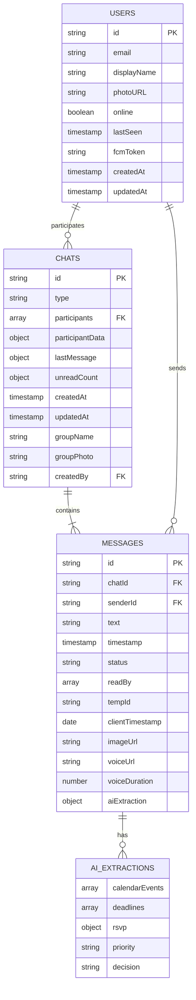

## Users Collection Structure

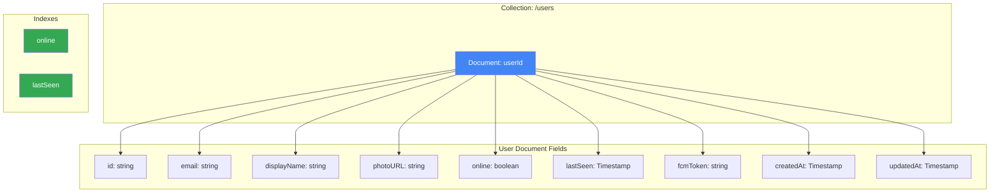

## Chats Collection Structure

```mermaid
graph TB
    subgraph "Collection: /chats"
        A[Document: chatId]
    end

    subgraph "Chat Document Fields"
        B[id: string]
        C[type: one-on-one | group]
        D[participants: string array]
        E[participantData: object]
        F[lastMessage: object]
        G[unreadCount: object]
        H[createdAt: Timestamp]
        I[updatedAt: Timestamp]
        J[groupName?: string]
        K[groupPhoto?: string]
        L[createdBy?: string]
    end

    A --> B
    A --> C
    A --> D
    A --> E
    A --> F
    A --> G
    A --> H
    A --> I
    A --> J
    A --> K
    A --> L

    E --> E1["{userId: {name, photoURL}}"]
    F --> F1["{text, senderId, timestamp}"]
    G --> G1["{userId: count}"]

    subgraph "Indexes"
        M[participants array-contains]
        N[updatedAt DESC]
    end

    style A fill:#4285f4,color:#fff
    style M fill:#34a853,color:#fff
    style N fill:#34a853,color:#fff
```

## Messages Subcollection Structure

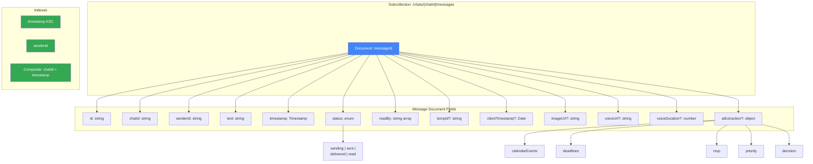

## AI Extraction Data Models

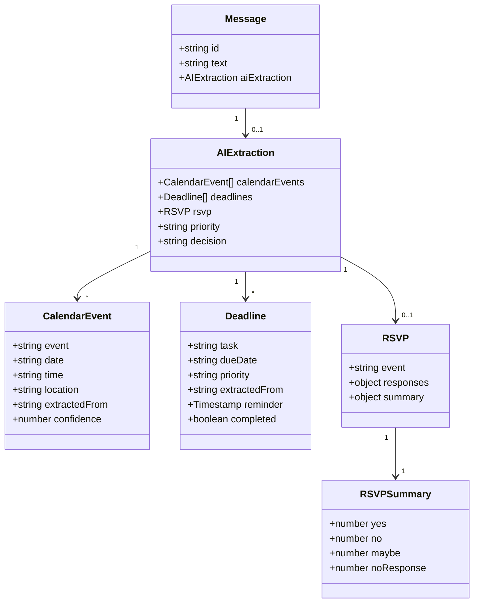

## Data Relationships

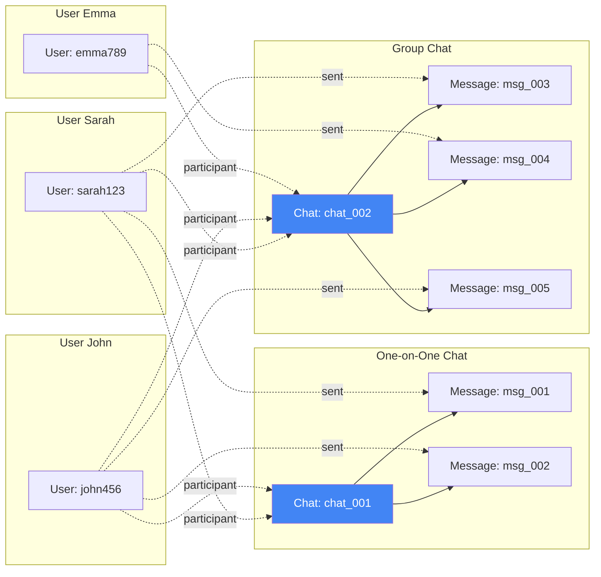

## Chat Participant Data Denormalization

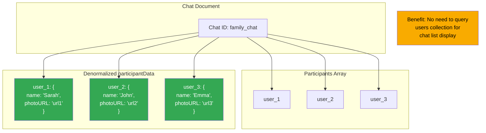

## Read Receipt Tracking

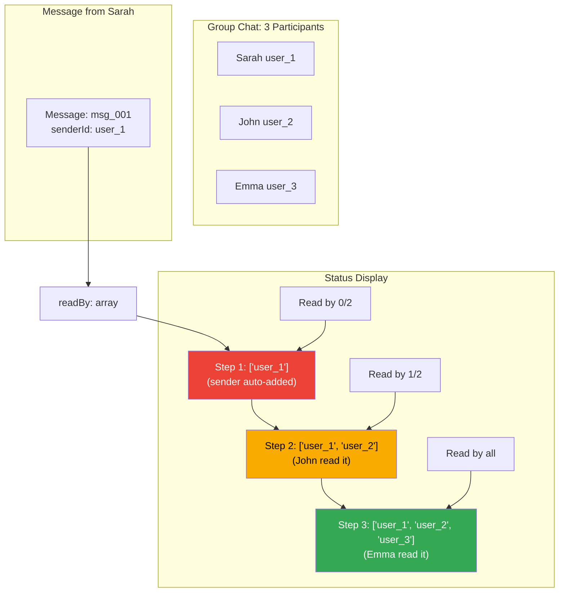

## Unread Count Management

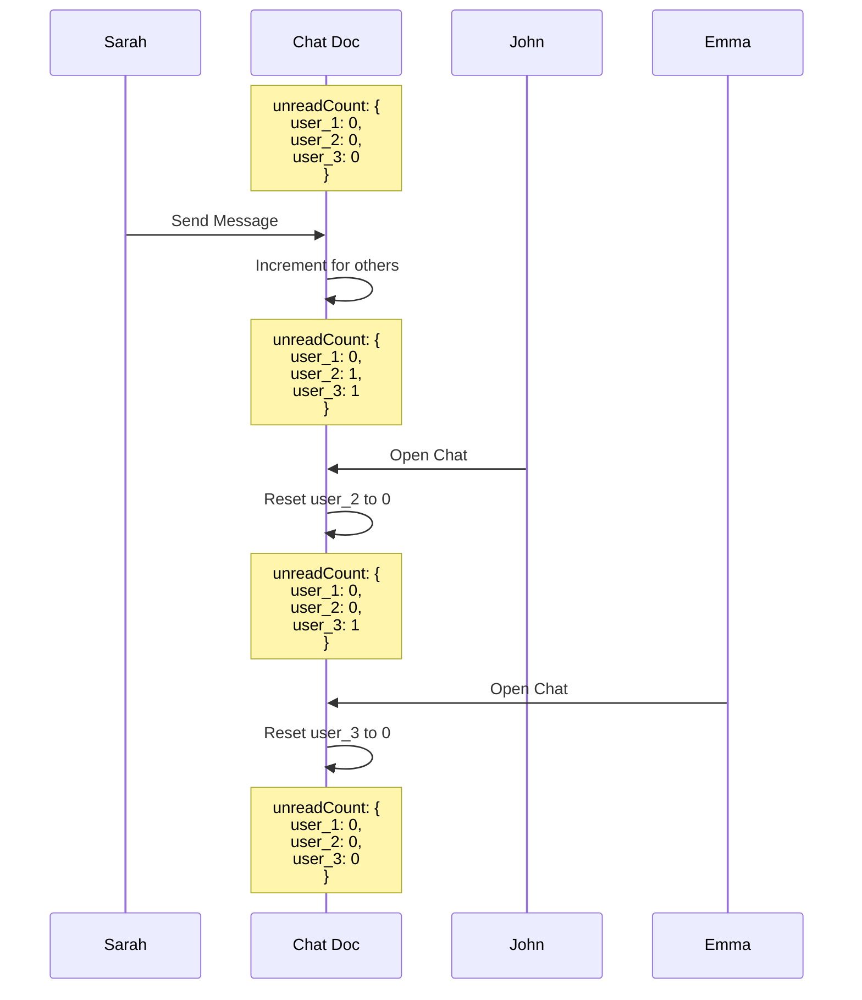

## Composite Indexes Required

```mermaid
graph TB
    subgraph "Index 1: Messages Query"
        A[Collection: messages]
        B[Field: chatId ASC]
        C[Field: timestamp ASC]
    end

    A --> B
    B --> C

    subgraph "Index 2: User Chats Query"
        D[Collection: chats]
        E[Field: participants CONTAINS]
        F[Field: updatedAt DESC]
    end

    D --> E
    E --> F

    subgraph "Index 3: Priority Messages"
        G[Collection: messages]
        H[Field: chatId ASC]
        I[Field: priority ASC]
        J[Field: timestamp DESC]
    end

    G --> H
    H --> I
    I --> J

    style A fill:#4285f4,color:#fff
    style D fill:#4285f4,color:#fff
    style G fill:#4285f4,color:#fff
```

## Data Size Considerations

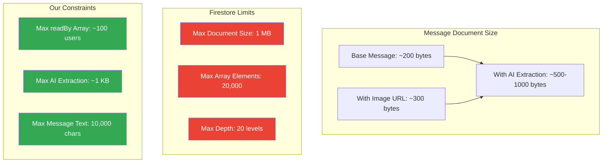

## Query Optimization Strategy

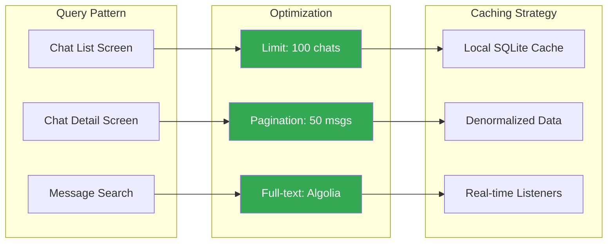

## Security Rules Data Access

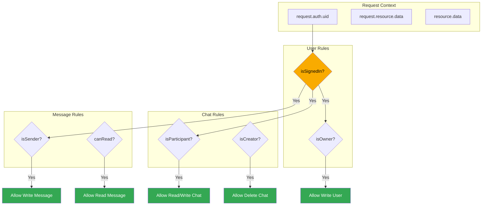

---

← [Back to Technical Architecture](../TechnicalArchitecture.md)
