# MessageAI - Implementation Timeline & Project Plan Diagrams

## 4-Day Sprint Overview


## Day 1: MVP Development (24 hours)


## Critical Path Analysis


## PR Breakdown with Dependencies

```mermaid
graph TB
    subgraph "Foundation (Day 1 Morning)"
        PR1[PR #1: Setup + Auth<br/>📦 Dependencies: None<br/>⏱️ 2 hours]
        PR2[PR #2: UI + Navigation<br/>📦 Depends: PR #1<br/>⏱️ 4 hours]
    end

    subgraph "Core Messaging (Day 1 Afternoon)"
        PR3[PR #3: Real-time Messaging<br/>📦 Depends: PR #2<br/>⏱️ 7 hours]
        PR4[PR #4: Offline Support<br/>📦 Depends: PR #3<br/>⏱️ 5 hours]
    end

    subgraph "Resilience (Day 1 Evening)"
        PR5[PR #5: Group + Push<br/>📦 Depends: PR #4<br/>⏱️ 5 hours]
        MVP[MVP Checkpoint<br/>🚦 GATE: All tests must pass<br/>⏱️ 1 hour validation]
    end

    subgraph "AI Features (Day 2)"
        PR6[PR #6: AI Infrastructure<br/>📦 Depends: MVP ✓<br/>⏱️ 4 hours]
        PR7[PR #7: Calendar + Priority<br/>📦 Depends: PR #6<br/>⏱️ 4 hours]
        PR8[PR #8: RSVP + Deadlines<br/>📦 Depends: PR #6<br/>⏱️ 4 hours parallel]
    end

    subgraph "Advanced (Day 3)"
        PR9[PR #9: Proactive Assistant<br/>📦 Depends: PR #7, PR #8<br/>⏱️ 8 hours]
        PR11A[PR #11A: Bonus Features<br/>📦 Depends: PR #9<br/>⏱️ 4 hours optional]
    end

    subgraph "Final (Day 4)"
        PR10A[PR #10A: Performance<br/>📦 Depends: PR #9<br/>⏱️ 4 hours]
        PR10B[PR #10B: Testing<br/>📦 Depends: PR #10A<br/>⏱️ 5 hours]
        PR11B[PR #11B: Demo + Docs<br/>📦 Depends: PR #10B<br/>⏱️ 6 hours]
    end

    PR1 --> PR2
    PR2 --> PR3
    PR3 --> PR4
    PR4 --> PR5
    PR5 --> MVP
    MVP --> PR6
    PR6 --> PR7
    PR6 --> PR8
    PR7 --> PR9
    PR8 --> PR9
    PR9 --> PR11A
    PR9 --> PR10A
    PR10A --> PR10B
    PR10B --> PR11B

    style MVP fill:#f9ab00,color:#000
    style PR11B fill:#34a853,color:#fff
```



## Parallel Work Opportunities

```mermaid
graph TB
    subgraph "Day 1 - Limited Parallelism"
        A[PR #1-3 Sequential<br/>Setup → UI → Messaging]
        B[After PR #3 Complete]
        C[PR #4 and PR #5<br/>Can overlap slightly<br/>Different files]
    end

    A --> B
    B --> C

    subgraph "Day 2 - Good Parallelism"
        D[PR #6 AI Infrastructure]
        E1[PR #7 Calendar + Priority]
        E2[PR #8 RSVP + Deadlines]
        F[Both can start after PR #6]
    end

    D --> F
    F --> E1
    F --> E2

    subgraph "Day 3 - Sequential"
        G[PR #9 Proactive Assistant<br/>Requires both PR #7 and PR #8]
    end

    E1 --> G
    E2 --> G

    subgraph "Day 4 - Some Parallelism"
        H[PR #10A Performance]
        I[PR #10B Testing]
        J[PR #11B Demo + Docs]
        K[Can start docs early]
    end

    H --> I
    I --> J
    H -.start early.-> K

    style F fill:#34a853,color:#fff
    style K fill:#34a853,color:#fff
```



## Risk Mitigation Timeline

```mermaid
graph TB
    Start([Start Day 1]) --> D1End{End of Day 1}

    D1End -->|MVP Complete| D2[Continue to Day 2]
    D1End -->|MVP Incomplete| D1Risk[🔴 HIGH RISK]

    D1Risk --> D1Action[Work overnight<br/>Skip sleep if needed<br/>MVP is hard gate]
    D1Action --> D1Retry{MVP Complete?}
    D1Retry -->|Yes| D2
    D1Retry -->|No| Fail1[Cannot proceed]

    D2 --> D2End{End of Day 2}

    D2End -->|3+ AI Features| D3[Continue to Day 3]
    D2End -->|<3 AI Features| D2Risk[🟡 MEDIUM RISK]

    D2Risk --> D2Action[Skip PR #11A bonus<br/>Focus on required 5]
    D2Action --> D3

    D3 --> D3End{End of Day 3}

    D3End -->|All AI Done| D4[Continue to Day 4]
    D3End -->|Assistant Incomplete| D3Risk[🟡 MEDIUM RISK]

    D3Risk --> D3Action[Simplify Proactive Assistant<br/>Basic conflict detection]
    D3Action --> D4

    D4 --> D4End{End of Day 4}

    D4End -->|All Complete| Submit[✅ Submit]
    D4End -->|Demo Incomplete| D4Risk[🟡 LOW RISK]

    D4Risk --> D4Action[Ship what you have<br/>Video is pass/fail]
    D4Action --> Submit

    style D1Risk fill:#ea4335,color:#fff
    style D2Risk fill:#f9ab00,color:#000
    style D3Risk fill:#f9ab00,color:#000
    style Submit fill:#34a853,color:#fff
```



## Testing Strategy Timeline


## MVP Checkpoint Gate

```mermaid
graph TB
    Start([End of Day 1]) --> Check1{All 11 MVP<br/>Requirements?}

    Check1 -->|No| Block1[🚫 BLOCKED<br/>Cannot proceed]
    Check1 -->|Yes| Check2{7 Stress<br/>Tests Pass?}

    Check2 -->|No| Block2[🚫 BLOCKED<br/>Fix failures]
    Check2 -->|Yes| Check3{Performance<br/>Targets Met?}

    Check3 -->|No| Block3[🚫 BLOCKED<br/>Optimize]
    Check3 -->|Yes| Check4{Documentation<br/>Complete?}

    Check4 -->|No| Warn[⚠️ Complete docs]
    Check4 -->|Yes| Pass[✅ MVP PASS]

    Block1 --> Fix1[Debug + Fix]
    Block2 --> Fix2[Debug + Fix]
    Block3 --> Fix3[Optimize]

    Fix1 --> Check1
    Fix2 --> Check2
    Fix3 --> Check3
    Warn --> Pass

    Pass --> Day2[Proceed to Day 2<br/>AI Features]

    style Block1 fill:#ea4335,color:#fff
    style Block2 fill:#ea4335,color:#fff
    style Block3 fill:#ea4335,color:#fff
    style Pass fill:#34a853,color:#fff
```



## Daily Progress Tracking


## Time Budget Breakdown


## PR Size Guidelines


## Commit Strategy


## Final Week Schedule

```mermaid
timeline
    title Complete 4-Day Sprint Breakdown
    section Monday (Day 1)
        00:00-02:00 : PR #1 Setup + Auth
        02:00-06:00 : PR #2 UI + Navigation
        06:00-13:00 : PR #3 Real-time Messaging
        13:00-18:00 : PR #4 Offline Support
        18:00-23:00 : PR #5 Group Chat + Push
        23:00-24:00 : MVP Checkpoint Validation
    section Tuesday (Day 2)
        00:00-04:00 : PR #6 AI Infrastructure
        04:00-08:00 : PR #7 Calendar + Priority
        08:00-12:00 : PR #8 RSVP + Deadlines
        12:00-16:00 : AI Accuracy Testing
        16:00-20:00 : Buffer / Refinement
        20:00-24:00 : Documentation
    section Wednesday (Day 3)
        00:00-08:00 : PR #9 Proactive Assistant
        08:00-12:00 : PR #11A Bonus Features
        12:00-16:00 : Integration Testing
        16:00-20:00 : Bug Fixes
        20:00-24:00 : Code Review
    section Thursday (Day 4)
        00:00-04:00 : PR #10A Performance
        04:00-09:00 : PR #10B Testing
        09:00-15:00 : PR #11B Demo Video
        15:00-21:00 : PR #11B README + Docs
        21:00-23:00 : Social Post
        23:00-24:00 : Final Submission
```

---

← [Back to Implementation Guide](../tasks/ShardingStrategy.md)
