# MessageAI - Message Flow & Real-Time Sync Diagrams

## Complete Message Lifecycle

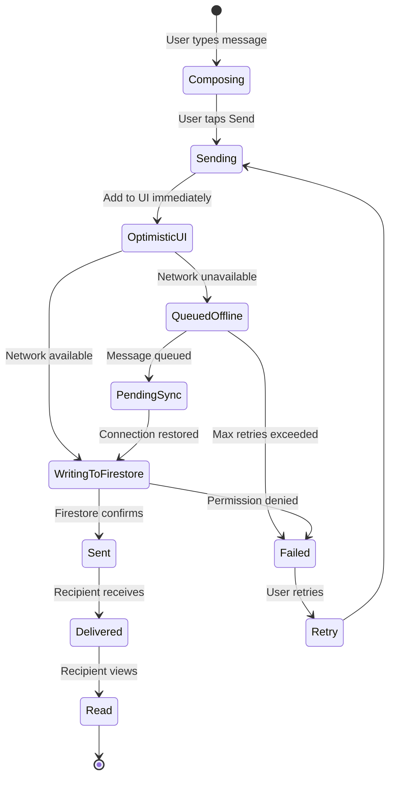

## Real-Time Message Send Flow

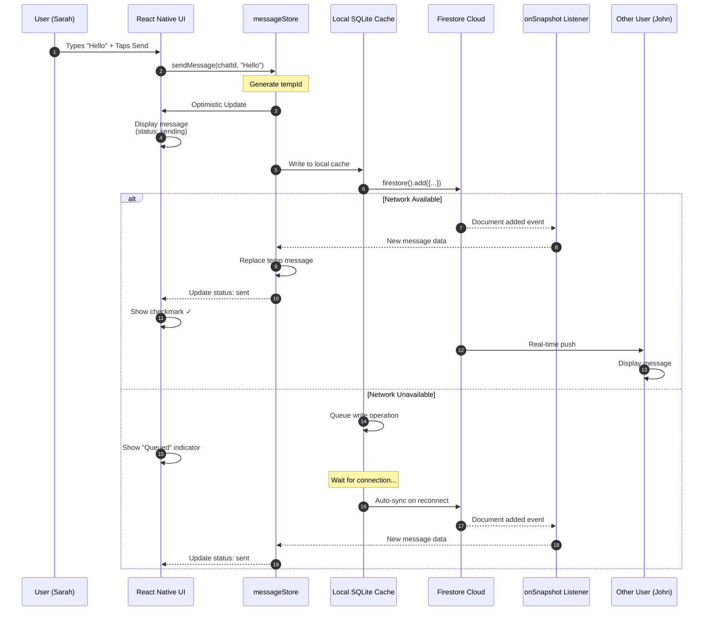

## Optimistic UI Pattern

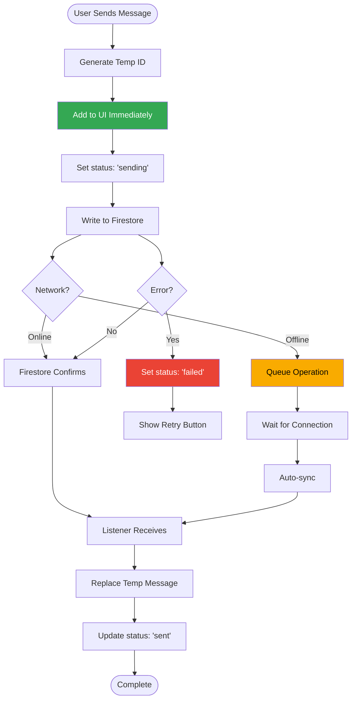

## Message Status Progression

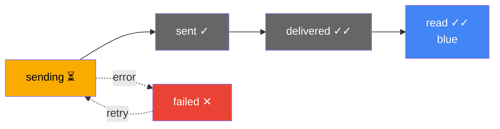

## Read Receipt Flow (One-on-One Chat)

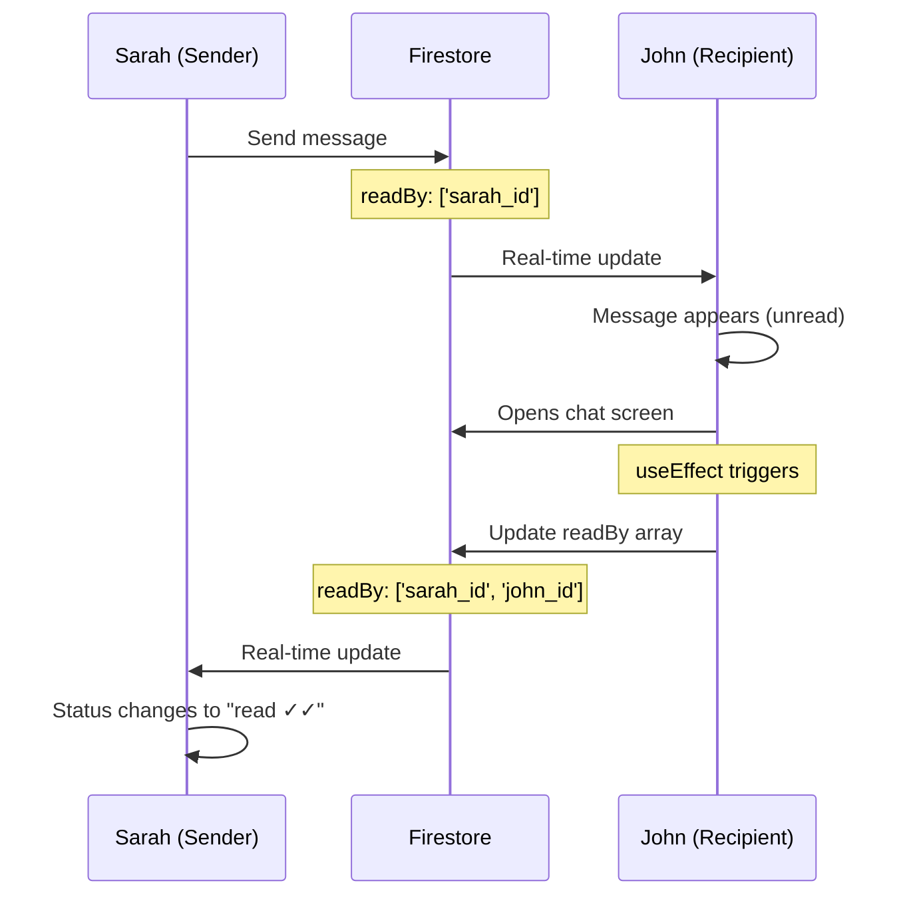

## Read Receipt Flow (Group Chat)

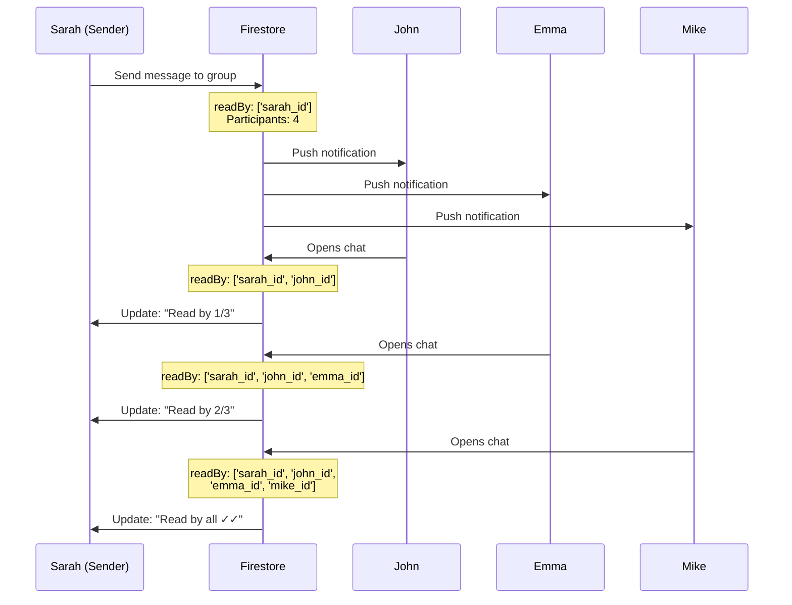

## Firestore Listener Pattern

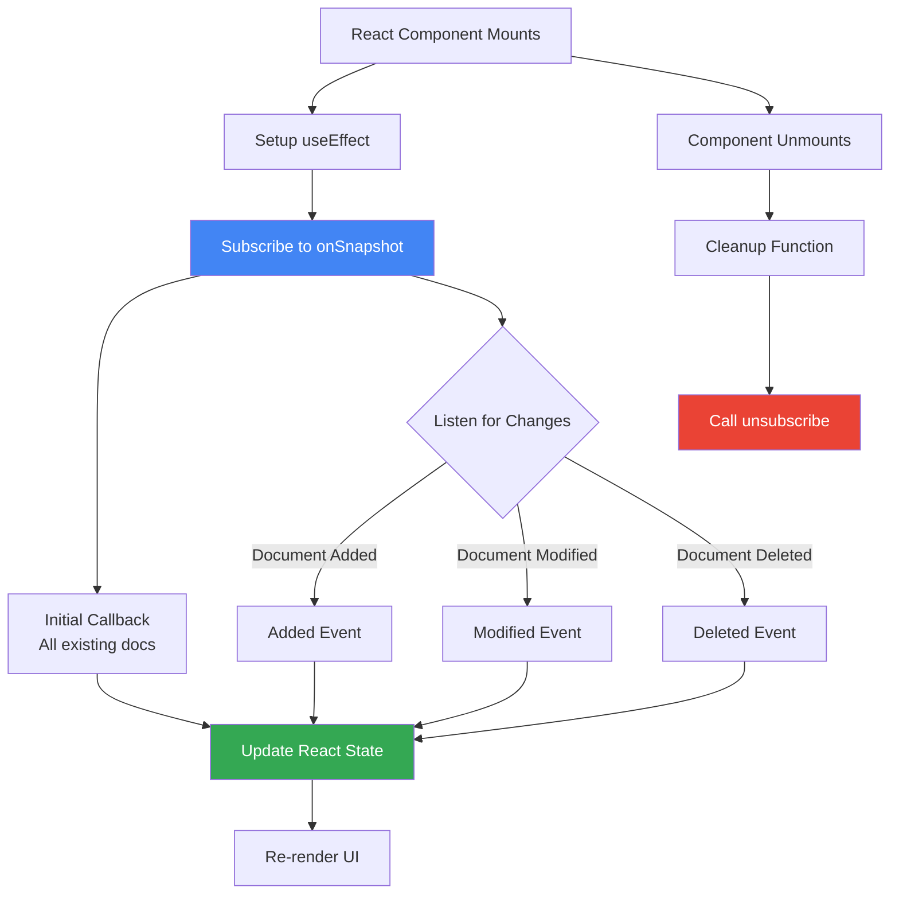

## Offline Message Queue

```mermaid
graph TB
    subgraph "User Offline"
        A[User sends 5 messages]
        B[Messages queued locally]
        C[UI shows "Queued" status]
    end

    subgraph "Local SQLite Queue"
        D[Message 1: queued]
        E[Message 2: queued]
        F[Message 3: queued]
        G[Message 4: queued]
        H[Message 5: queued]
    end

    subgraph "Connection Restored"
        I[Network detected]
        J[Firestore.enableNetwork]
        K[Process queue]
    end

    subgraph "Sync to Cloud"
        L[Upload Message 1]
        M[Upload Message 2]
        N[Upload Message 3]
        O[Upload Message 4]
        P[Upload Message 5]
    end

    A --> B
    B --> C
    B --> D
    B --> E
    B --> F
    B --> G
    B --> H

    D --> I
    E --> I
    F --> I
    G --> I
    H --> I

    I --> J
    J --> K
    K --> L
    L --> M
    M --> N
    N --> O
    O --> P

    P --> Q[All synced ✓]

    style C fill:#f9ab00,color:#000
    style K fill:#4285f4,color:#fff
    style Q fill:#34a853,color:#fff
```

## Message Ordering Strategy

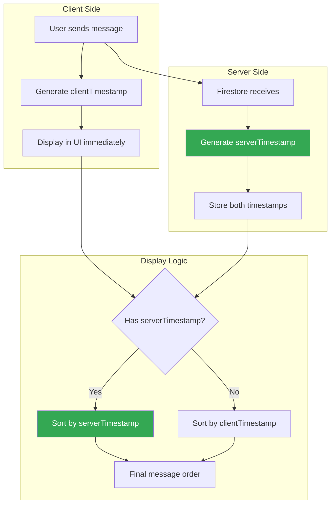

## Typing Indicator Flow

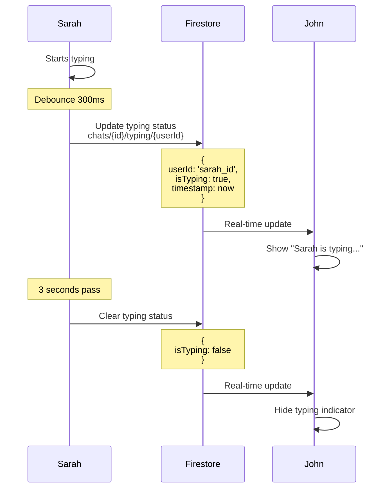

## Presence (Online/Offline) System

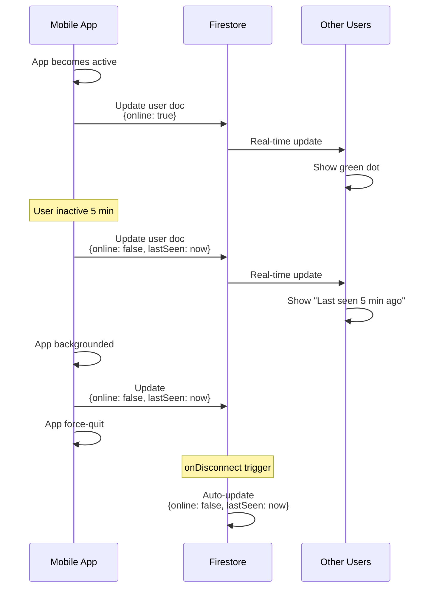

## Batch Update Pattern (Read Receipts)

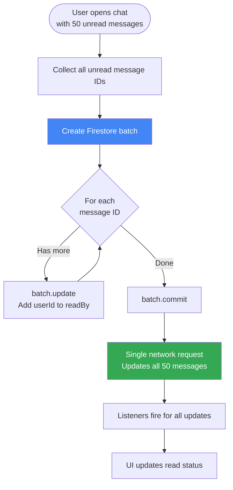

## Message Delivery Metrics

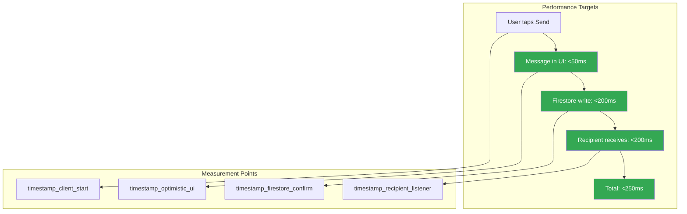

## Error Handling Flow

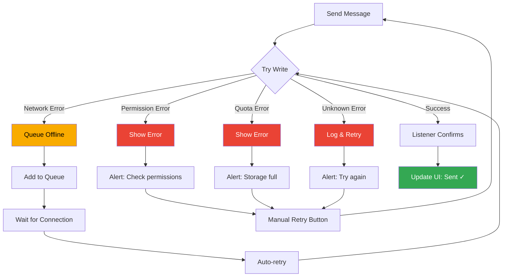

## Conflict Resolution

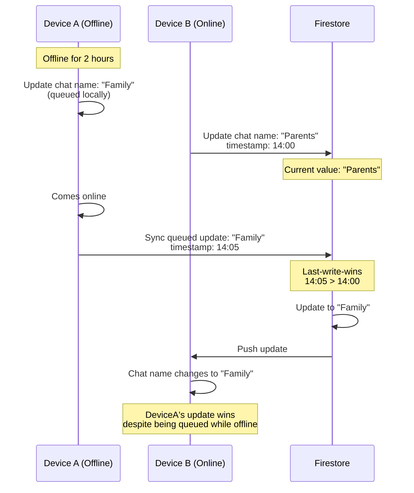

## Pagination Strategy

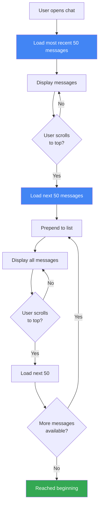

---

← [Back to Messaging Infrastructure](../MessagingInfrastructure.md)
