# MessageAI - Offline-First Architecture Diagrams

## Offline-First Philosophy

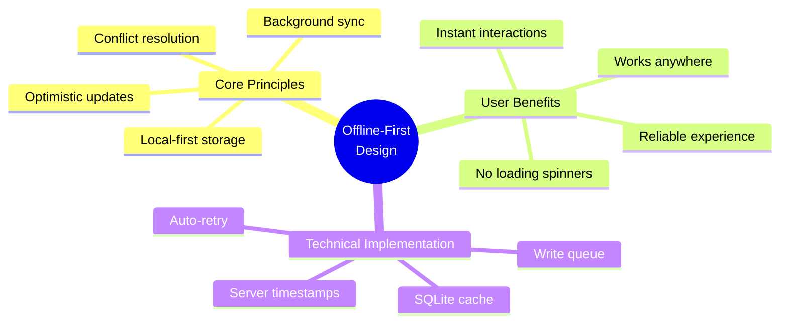

## Complete Offline Flow

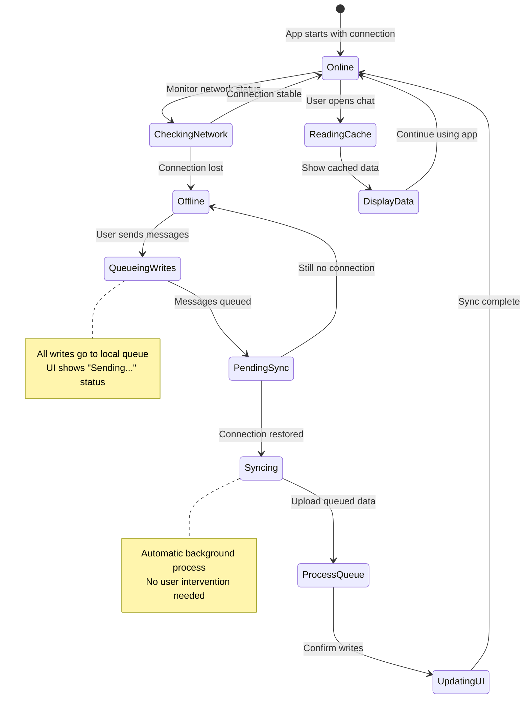

## Offline Scenario 1: Send While Offline

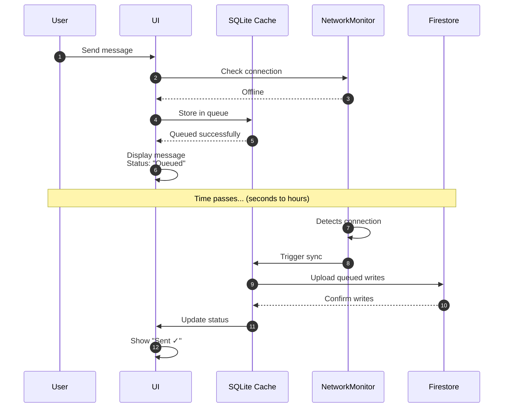

## Offline Scenario 2: Receive While Offline

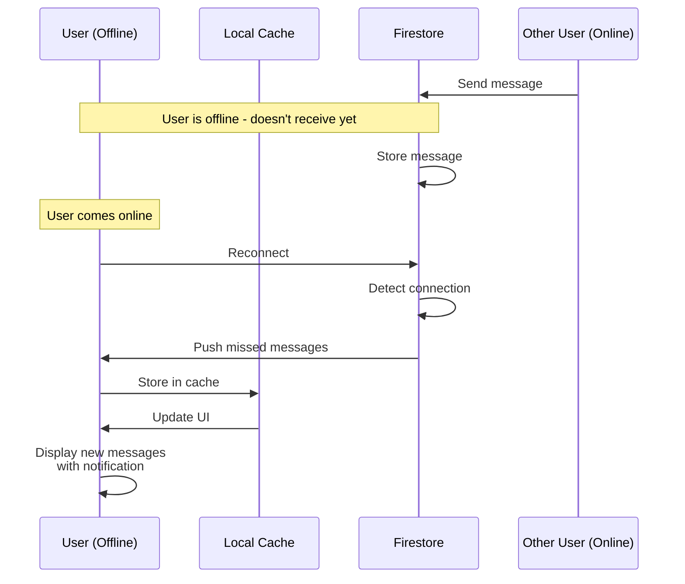

## Offline Scenario 3: App Force-Quit

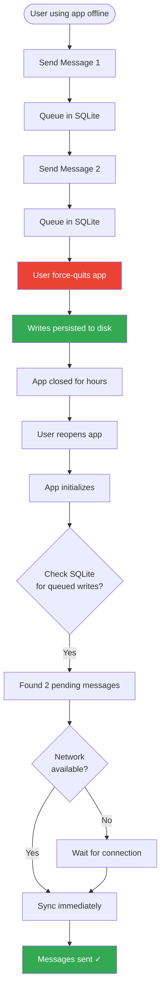

## Network State Management

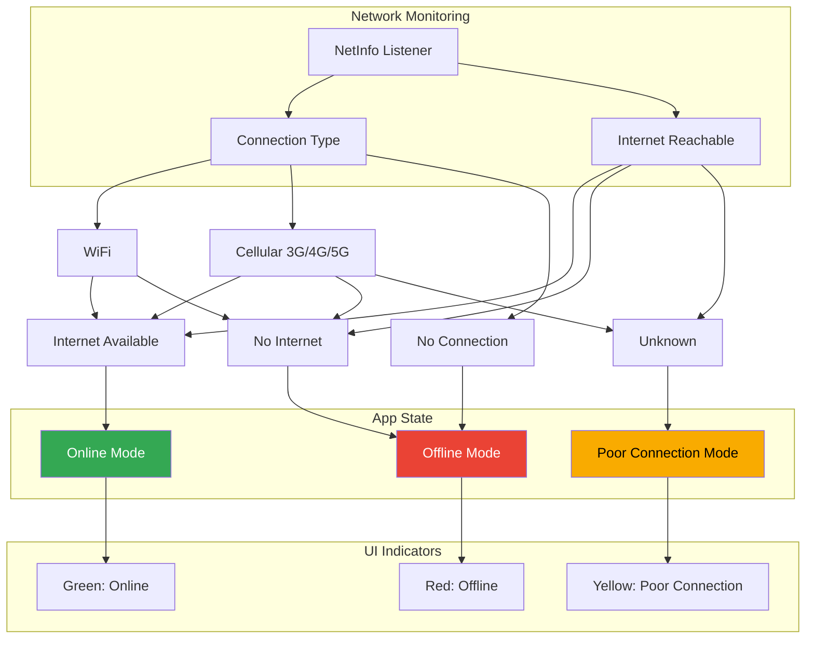

## SQLite Cache Architecture

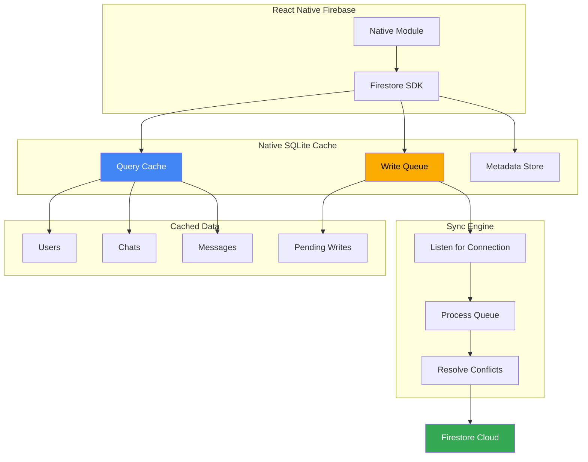

## Write Queue Processing

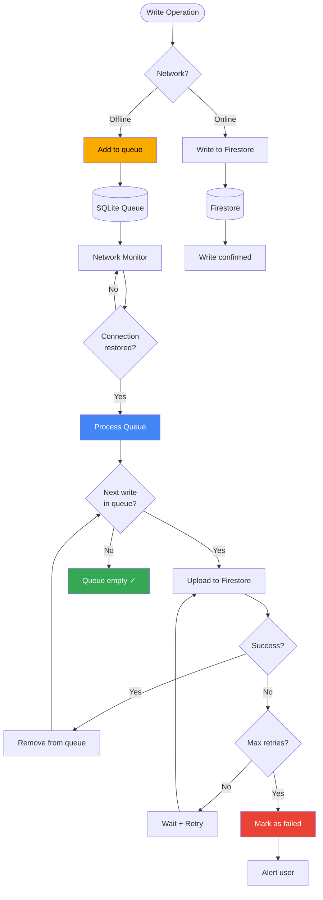

## Optimistic UI with Rollback

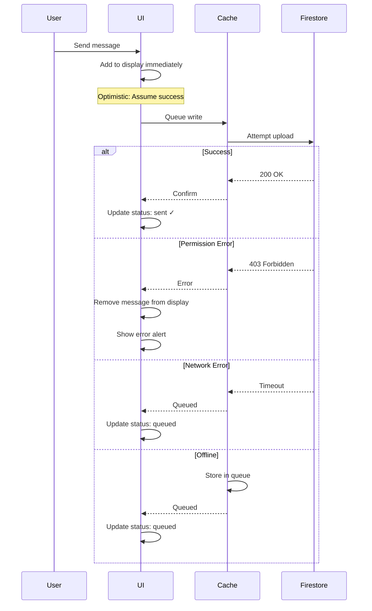

## Sync Performance Targets

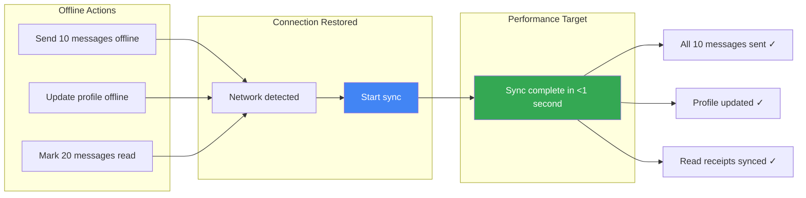

## Poor Network Handling (3G)

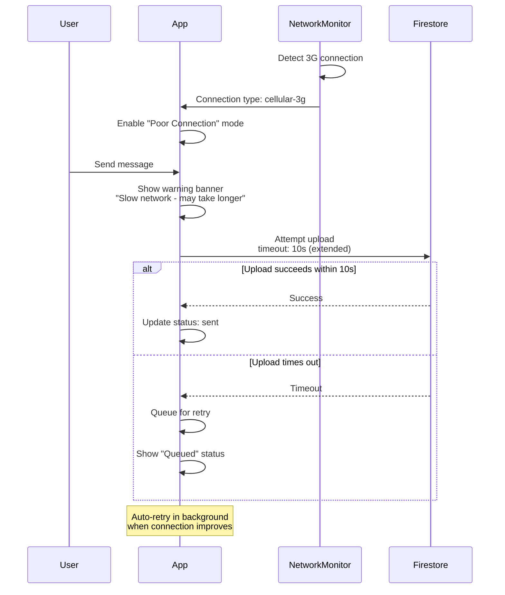

## Conflict Resolution: Last-Write-Wins

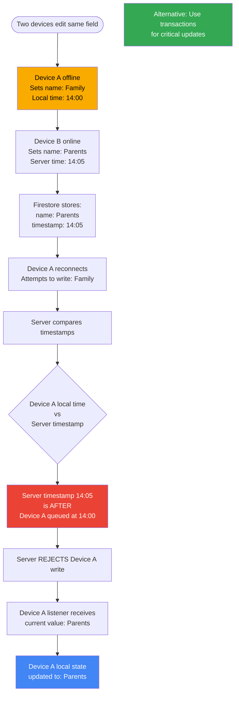

## onDisconnect Handlers (Presence)

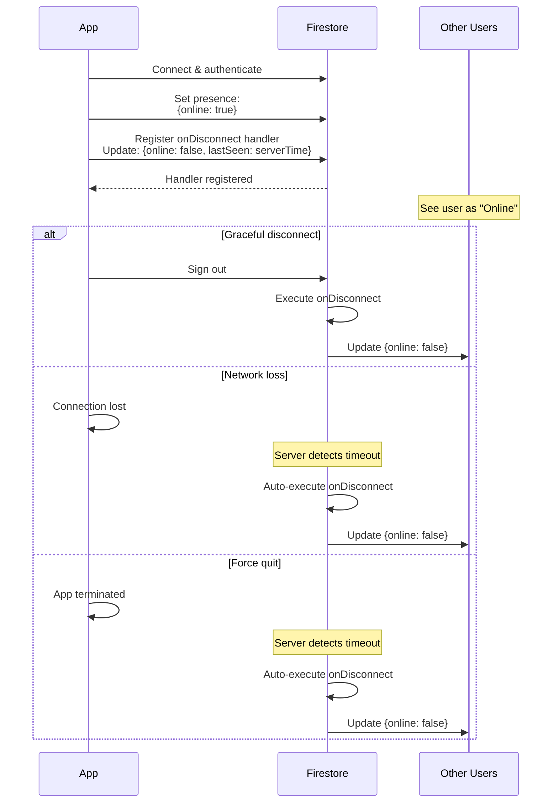

## Cache Size Management

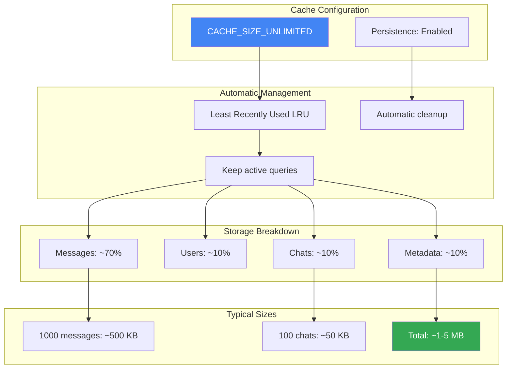

## Offline Testing Scenarios

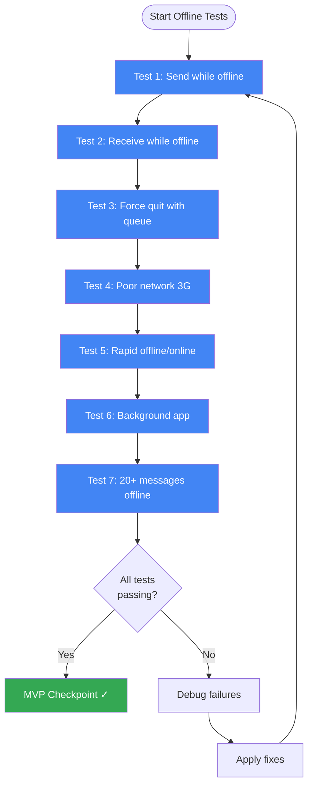

## Resilience Checklist

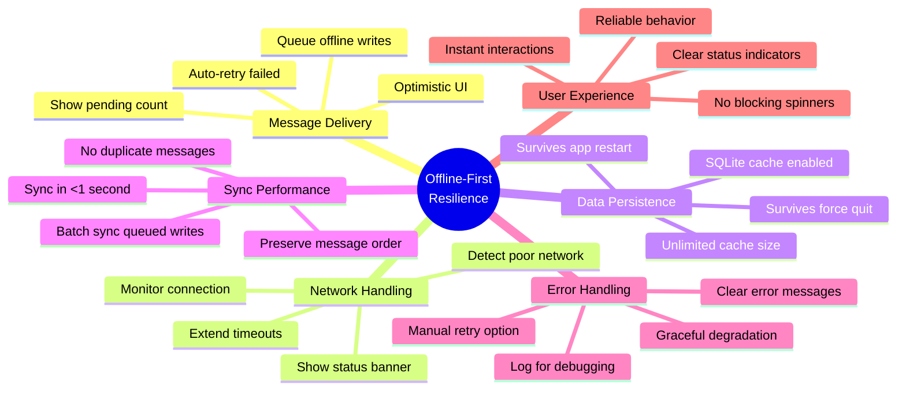

## Sync Recovery Flow

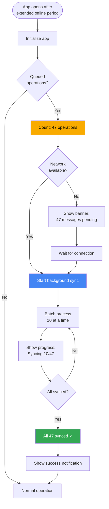

---

← [Back to Messaging Infrastructure](../MessagingInfrastructure.md)
