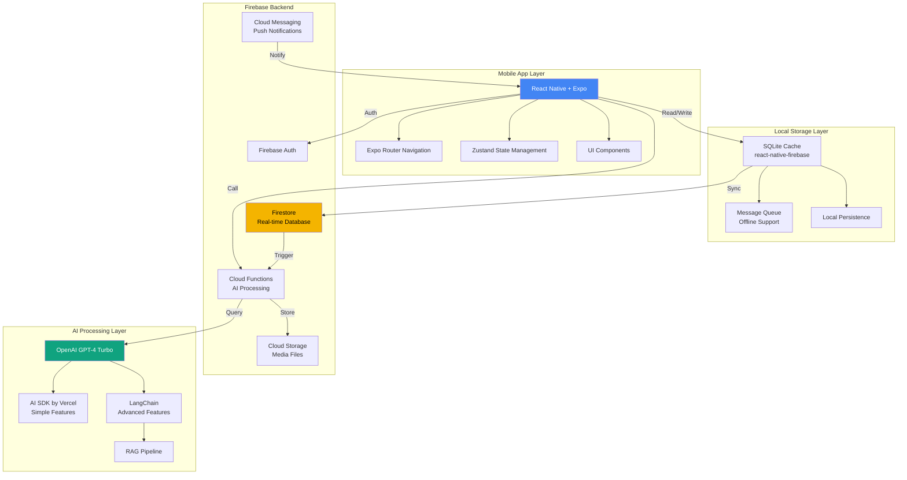
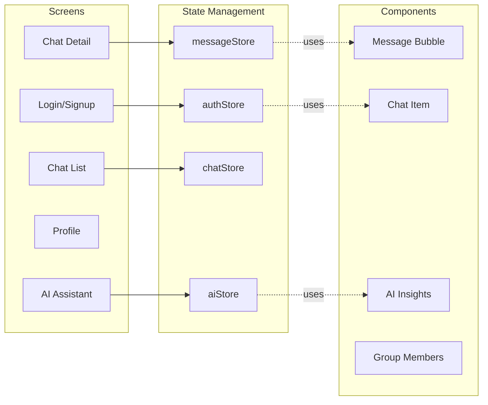
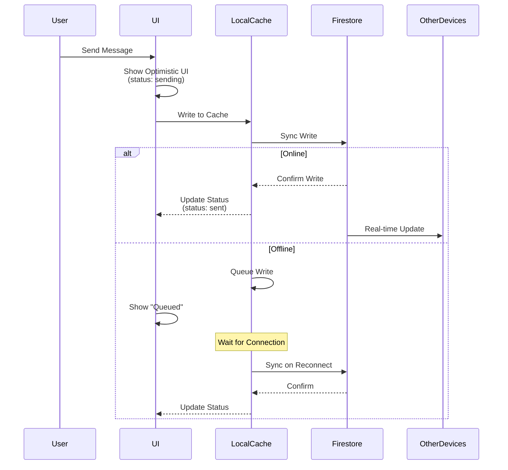
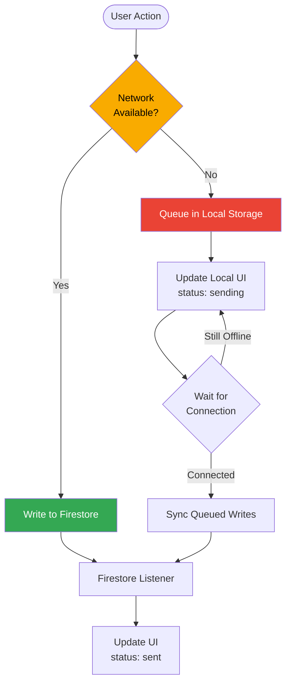
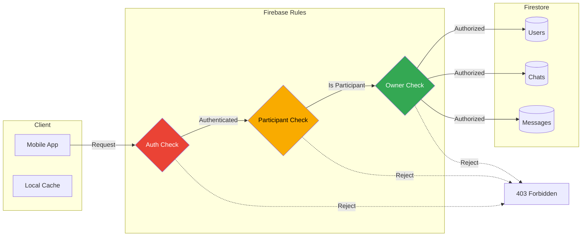
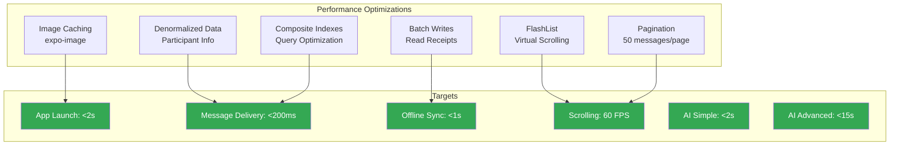
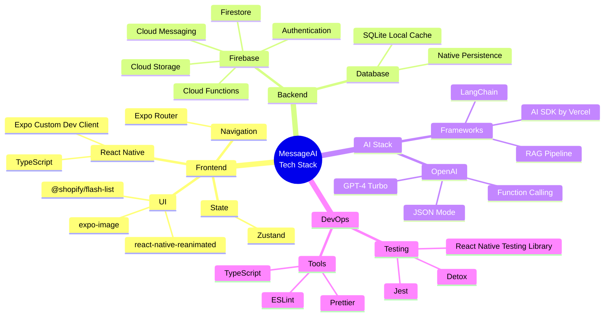
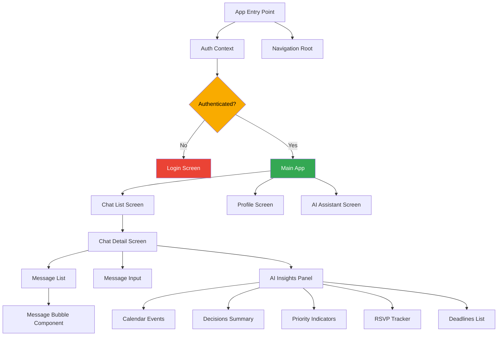

# MessageAI - System Architecture Diagrams

## High-Level System Architecture



## Layer Breakdown

### 1. Mobile App Layer (React Native + Expo)



### 2. Real-Time Sync Architecture



### 3. Firebase Services Integration

```mermaid
graph TB
    subgraph "Firebase Services"
        A[Firestore]
        B[Authentication]
        C[Cloud Functions]
        D[Cloud Storage]
        E[Cloud Messaging]
    end

    subgraph "Collections"
        A1[/users]
        A2[/chats]
        A3[/chats/messages]
    end

    subgraph "Functions"
        C1[calendarExtraction]
        C2[decisionSummary]
        C3[priorityDetection]
        C4[rsvpTracking]
        C5[deadlineExtraction]
        C6[proactiveAssistant]
    end

    A --> A1
    A --> A2
    A --> A3

    C --> C1
    C --> C2
    C --> C3
    C --> C4
    C --> C5
    C --> C6

    C1 -.calls.-> OpenAI[OpenAI API]
    C2 -.calls.-> OpenAI
    C3 -.calls.-> OpenAI
    C4 -.calls.-> OpenAI
    C5 -.calls.-> OpenAI
    C6 -.calls.-> OpenAI

    style A fill:#f4b400,color:#000
    style C fill:#4285f4,color:#fff
    style OpenAI fill:#10a37f,color:#fff
```

### 4. Offline-First Architecture



### 5. Security & Data Flow



## Performance Architecture



## Technology Stack Overview



## Component Dependency Graph



---

← [Back to Technical Architecture](../TechnicalArchitecture.md)
