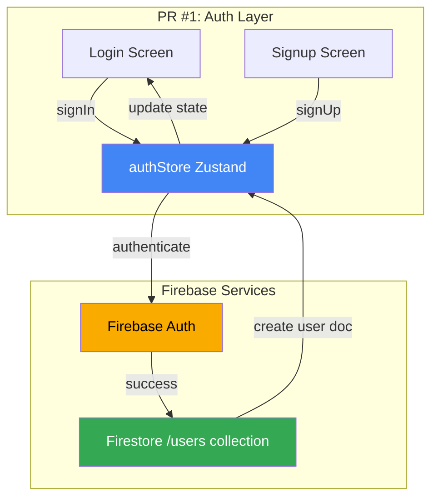
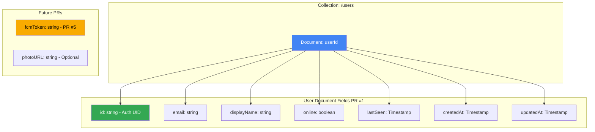

# PR #1: Project Setup + Authentication

**Estimated Time:** 2-3 hours
**Dependencies:** None (foundation PR)

---

## 📚 Context Files to Read

Read these files in order for context:

1. **`docs/plans/01-messageai-prd.md`**
   - Section 2: User Requirements (understand authentication needs)
   - Section 3.2: MVP Requirements (items 5-7: auth flows)

2. **`docs/plans/02-technical-architecture.md`**
   - Section 1: Tech Stack (Expo Custom Dev Client, Firebase Auth, Firestore)
   - Section 3: Data Models (User model structure)
   - Section 4: Security & Firestore Rules (authentication rules)

3. **`docs/plans/06-implementation-foundation.md`**
   - Complete file (detailed implementation steps and all test code)

---

## 🏗️ Architecture Context

### Relevant Architecture References

For this PR, review these specific sections in the architecture documents:

**From `docs/architecture/TechnicalArchitecture.md`:**
- **Section 2: System Architecture** → High-Level Architecture diagram
  - Focus: Mobile App Layer (Screens, Components, Zustand Stores)
  - Focus: Firebase Backend (Firestore `/users/{uid}`, Firebase Auth)

- **Section 3: Data Models** → Users Collection: `/users/{userId}`
  - Complete User interface definition
  - Field descriptions and usage
  - Firestore indexes

- **Section 4: Security & Firestore Rules** → Users Collection rules
  - Authentication requirements
  - Read/write permissions

**Key Data Model for PR #1:**
- User collection structure (see TechnicalArchitecture.md Section 3)
- Fields created in this PR: id, email, displayName, online, lastSeen, createdAt, updatedAt
- Fields for future PRs: fcmToken (PR #5), photoURL (optional)

### 📊 Visual Architecture Diagrams

**System Architecture for PR #1:**

See full diagrams: [docs/architecture/diagrams/SystemArchitecture.md](../architecture/diagrams/SystemArchitecture.md)



**User Data Model:**

See full diagrams: [docs/architecture/diagrams/DataModels.md](../architecture/diagrams/DataModels.md)



---

## 🏗️ What Already Exists (Code Reuse)

**Before this PR:**
- ❌ Nothing - this is the foundation PR
- Empty project directory

**After this PR:**
- ✅ Expo Custom Dev Client configured
- ✅ Firebase initialized (Auth + Firestore)
- ✅ Authentication system working
- ✅ Basic navigation structure
- ✅ 13 tests passing

---

## ✅ Tasks Breakdown

### Task 1: Project Initialization (30 min)

**Action:** CREATE new project

**Steps:**
```bash
# Create Expo project
npx create-expo-app@latest messageai --template blank-typescript
cd messageai

# Install dependencies
npx expo install expo-router react-native-safe-area-context react-native-screens expo-linking expo-constants expo-status-bar

# Install Firebase
npm install @react-native-firebase/app @react-native-firebase/auth @react-native-firebase/firestore @react-native-firebase/storage @react-native-firebase/messaging

# Install UI & state management
npm install zustand react-native-reanimated @shopify/flash-list expo-image

# Install utilities
npm install @react-native-community/netinfo

# Install testing
npm install --save-dev jest @testing-library/react-native @testing-library/jest-native @types/jest
```

**Verify:**
```bash
npm install  # Should complete without errors
```

---

### Task 2: Configure Expo Custom Dev Client (30 min)

**Action:** CREATE configuration files

#### 2.1: CREATE `app.json`

**File:** `app.json`
**Purpose:** Configure Expo with Firebase plugins and app metadata

**Implementation:**
```json
{
  "expo": {
    "name": "MessageAI",
    "slug": "messageai",
    "version": "1.0.0",
    "scheme": "messageai",
    "plugins": [
      "@react-native-firebase/app",
      "@react-native-firebase/auth",
      "expo-router"
    ],
    "ios": {
      "bundleIdentifier": "com.yourname.messageai",
      "googleServicesFile": "./GoogleService-Info.plist",
      "supportsTablet": true
    },
    "android": {
      "package": "com.yourname.messageai",
      "googleServicesFile": "./google-services.json",
      "adaptiveIcon": {
        "foregroundImage": "./assets/adaptive-icon.png",
        "backgroundColor": "#ffffff"
      }
    },
    "extra": {
      "router": {
        "origin": false
      }
    }
  }
}
```

**Software Engineering Principle:** Configuration as Code
- Single source of truth for app configuration
- Version controlled
- Platform-specific settings clearly separated

#### 2.2: Firebase Setup

**Action:** CREATE Firebase project and download config files

**Manual Steps:**
1. Go to https://console.firebase.google.com
2. Create new project: "MessageAI"
3. Enable Authentication → Email/Password provider
4. Enable Firestore Database
5. Add iOS app → Download `GoogleService-Info.plist` → Place in project root
6. Add Android app → Download `google-services.json` → Place in project root

**Verify:**
- [ ] `GoogleService-Info.plist` exists in project root
- [ ] `google-services.json` exists in project root

---

### Task 3: Firebase Configuration (30 min)

**Action:** CREATE Firebase initialization

#### 3.1: CREATE `lib/firebase/config.ts`

**File:** `lib/firebase/config.ts`
**Purpose:** Initialize Firebase services with offline support

**Implementation:**
```typescript
import firestore from '@react-native-firebase/firestore';

// Enable offline persistence with unlimited cache
firestore().settings({
  persistence: true,
  cacheSizeBytes: firestore.CACHE_SIZE_UNLIMITED,
});

// Export Firebase services
export { firestore };
export { default as auth } from '@react-native-firebase/auth';
export { default as storage } from '@react-native-firebase/storage';
```

**Software Engineering Principles:**
- **Separation of Concerns:** Firebase config isolated from business logic
- **Single Responsibility:** One file for all Firebase initialization
- **Dependency Injection:** Services exported for import elsewhere

**Pattern to Follow:**
```typescript
// Other files will import like this:
import { auth, firestore } from '@/lib/firebase/config';

// NOT like this (avoid):
import auth from '@react-native-firebase/auth'; // Don't do this elsewhere
```

**Why:** Centralized configuration makes changes easier (e.g., adding analytics later)

#### 3.2: CREATE Firebase Configuration Tests

**File:** `lib/firebase/__tests__/config.test.ts`
**Purpose:** Verify Firebase initialized correctly

**Implementation:**
```typescript
import { firestore, auth } from '../config';

describe('Firebase Configuration', () => {
  it('should initialize Firestore', () => {
    expect(firestore).toBeDefined();
    expect(firestore().app.name).toBe('[DEFAULT]');
  });

  it('should initialize Auth', () => {
    expect(auth).toBeDefined();
    expect(auth().app.name).toBe('[DEFAULT]');
  });

  it('should have offline persistence enabled', () => {
    const settings = firestore()._settings;
    expect(settings.persistence).toBe(true);
  });
});
```

**Test Pattern:** AAA (Arrange, Act, Assert)
- Arrange: Import services
- Act: Check properties
- Assert: Verify expectations

**Run test:**
```bash
npm test -- lib/firebase/__tests__/config.test.ts
# Expected: 3/3 tests passing
```

---

### Task 4: Create User Type (15 min)

**Action:** CREATE TypeScript type definitions

#### 4.1: CREATE `types/user.ts`

**File:** `types/user.ts`
**Purpose:** Define User data model (type safety)

**Implementation:**
```typescript
import { FirebaseAuthTypes } from '@react-native-firebase/auth';

export interface User {
  id: string;
  email: string;
  displayName: string;
  photoURL?: string;
  online: boolean;
  lastSeen: Date;
  fcmToken?: string;
  createdAt: Date;
  updatedAt: Date;
}

// Re-export Firebase auth user type
export type AuthUser = FirebaseAuthTypes.User;
```

**Software Engineering Principles:**
- **Type Safety:** Prevents runtime errors from wrong data types
- **Data Abstraction:** Separates Firestore schema from TypeScript types
- **Documentation:** Types serve as inline documentation

**Pattern to Follow:**
- All data models go in `types/` directory
- Each entity gets its own file (user.ts, chat.ts, message.ts)
- Export both Firestore interface and any Firebase-specific types

---

### Task 5: Authentication Store (1 hour)

**Action:** CREATE state management for authentication

#### 5.1: CREATE `lib/store/authStore.ts`

**File:** `lib/store/authStore.ts`
**Purpose:** Manage authentication state and actions

**Implementation:**
```typescript
import { create } from 'zustand';
import auth, { FirebaseAuthTypes } from '@react-native-firebase/auth';
import firestore from '@react-native-firebase/firestore';

interface AuthState {
  user: FirebaseAuthTypes.User | null;
  loading: boolean;
  error: string | null;

  // Actions
  signUp: (email: string, password: string, displayName: string) => Promise<void>;
  signIn: (email: string, password: string) => Promise<void>;
  signOut: () => Promise<void>;
  setUser: (user: FirebaseAuthTypes.User | null) => void;
  clearError: () => void;
}

export const useAuthStore = create<AuthState>((set, get) => ({
  // Initial state
  user: null,
  loading: false,
  error: null,

  // Sign up action
  signUp: async (email, password, displayName) => {
    try {
      set({ loading: true, error: null });

      // Create auth user
      const userCredential = await auth().createUserWithEmailAndPassword(email, password);

      // Update profile
      await userCredential.user.updateProfile({ displayName });

      // Create Firestore user document
      await firestore().collection('users').doc(userCredential.user.uid).set({
        id: userCredential.user.uid,
        email,
        displayName,
        online: true,
        lastSeen: firestore.FieldValue.serverTimestamp(),
        createdAt: firestore.FieldValue.serverTimestamp(),
        updatedAt: firestore.FieldValue.serverTimestamp(),
      });

      set({ loading: false });
    } catch (error: any) {
      set({ loading: false, error: error.message });
      throw error;
    }
  },

  // Sign in action
  signIn: async (email, password) => {
    try {
      set({ loading: true, error: null });

      await auth().signInWithEmailAndPassword(email, password);

      // Update online status
      const currentUser = auth().currentUser;
      if (currentUser) {
        await firestore().collection('users').doc(currentUser.uid).update({
          online: true,
          lastSeen: firestore.FieldValue.serverTimestamp(),
        });
      }

      set({ loading: false });
    } catch (error: any) {
      set({ loading: false, error: error.message });
      throw error;
    }
  },

  // Sign out action
  signOut: async () => {
    try {
      set({ loading: true, error: null });

      // Update user status before signing out
      const currentUser = auth().currentUser;
      if (currentUser) {
        await firestore().collection('users').doc(currentUser.uid).update({
          online: false,
          lastSeen: firestore.FieldValue.serverTimestamp(),
        });
      }

      await auth().signOut();
      set({ user: null, loading: false });
    } catch (error: any) {
      set({ loading: false, error: error.message });
      throw error;
    }
  },

  // Setters
  setUser: (user) => set({ user }),
  clearError: () => set({ error: null }),
}));
```

**Software Engineering Principles:**

1. **State Pattern:** Centralized state management
   - All auth state in one place
   - Predictable state updates via actions

2. **Error Handling Pattern:**
   ```typescript
   try {
     set({ loading: true, error: null }); // Start
     // ... async operation
     set({ loading: false }); // Success
   } catch (error) {
     set({ loading: false, error: error.message }); // Failure
     throw error; // Re-throw for component handling
   }
   ```

3. **Separation of Concerns:**
   - authStore handles state
   - Firebase handles persistence
   - Components handle UI

**Pattern to Follow (for all stores):**
```typescript
interface StoreState {
  // Data
  someData: Type;
  loading: boolean;
  error: string | null;

  // Actions (async operations)
  someAction: () => Promise<void>;
}

export const useStore = create<StoreState>((set, get) => ({
  // Initial state
  someData: null,
  loading: false,
  error: null,

  // Actions with error handling
  someAction: async () => {
    try {
      set({ loading: true, error: null });
      // ... do work
      set({ loading: false });
    } catch (error: any) {
      set({ loading: false, error: error.message });
      throw error;
    }
  },
}));
```

This pattern will be reused for `chatStore`, `messageStore`, etc.

#### 5.2: CREATE authStore Unit Tests

**File:** `lib/store/__tests__/authStore.test.ts`
**Purpose:** Test authentication logic without Firebase

**Implementation:**
```typescript
import { renderHook, act } from '@testing-library/react-native';
import { useAuthStore } from '../authStore';
import auth from '@react-native-firebase/auth';
import firestore from '@react-native-firebase/firestore';

// Mock Firebase modules
jest.mock('@react-native-firebase/auth');
jest.mock('@react-native-firebase/firestore');

describe('authStore', () => {
  let mockAuth: any;
  let mockFirestore: any;

  beforeEach(() => {
    // Reset store state before each test
    useAuthStore.setState({ user: null, loading: false, error: null });

    // Setup Firebase mocks
    mockAuth = {
      createUserWithEmailAndPassword: jest.fn(),
      signInWithEmailAndPassword: jest.fn(),
      signOut: jest.fn(),
      currentUser: null,
    };

    mockFirestore = {
      collection: jest.fn(() => ({
        doc: jest.fn(() => ({
          set: jest.fn(),
          update: jest.fn(),
        })),
      })),
      FieldValue: {
        serverTimestamp: jest.fn(() => 'TIMESTAMP'),
      },
    };

    (auth as jest.Mock).mockReturnValue(mockAuth);
    (firestore as jest.Mock).mockReturnValue(mockFirestore);
  });

  describe('signUp', () => {
    it('should successfully create a new user', async () => {
      const mockUser = {
        uid: 'test-uid',
        email: 'test@example.com',
        updateProfile: jest.fn(),
      };

      mockAuth.createUserWithEmailAndPassword.mockResolvedValue({
        user: mockUser,
      });

      const { result } = renderHook(() => useAuthStore());

      await act(async () => {
        await result.current.signUp('test@example.com', 'password123', 'Test User');
      });

      // Verify Firebase auth called
      expect(mockAuth.createUserWithEmailAndPassword).toHaveBeenCalledWith(
        'test@example.com',
        'password123'
      );

      // Verify profile updated
      expect(mockUser.updateProfile).toHaveBeenCalledWith({
        displayName: 'Test User',
      });

      // Verify final state
      expect(result.current.loading).toBe(false);
      expect(result.current.error).toBe(null);
    });

    it('should handle signup errors', async () => {
      const error = new Error('Email already in use');
      mockAuth.createUserWithEmailAndPassword.mockRejectedValue(error);

      const { result } = renderHook(() => useAuthStore());

      await act(async () => {
        try {
          await result.current.signUp('test@example.com', 'password123', 'Test User');
        } catch (e) {
          // Expected to throw
        }
      });

      expect(result.current.loading).toBe(false);
      expect(result.current.error).toBe('Email already in use');
    });

    it('should set loading state during signup', async () => {
      mockAuth.createUserWithEmailAndPassword.mockImplementation(
        () => new Promise(resolve => setTimeout(resolve, 100))
      );

      const { result } = renderHook(() => useAuthStore());

      act(() => {
        result.current.signUp('test@example.com', 'password123', 'Test User');
      });

      // Should be loading immediately
      expect(result.current.loading).toBe(true);
    });
  });

  describe('signIn', () => {
    it('should successfully sign in existing user', async () => {
      mockAuth.currentUser = { uid: 'test-uid' };
      mockAuth.signInWithEmailAndPassword.mockResolvedValue({
        user: { uid: 'test-uid' },
      });

      const { result } = renderHook(() => useAuthStore());

      await act(async () => {
        await result.current.signIn('test@example.com', 'password123');
      });

      expect(mockAuth.signInWithEmailAndPassword).toHaveBeenCalledWith(
        'test@example.com',
        'password123'
      );
      expect(result.current.loading).toBe(false);
      expect(result.current.error).toBe(null);
    });

    it('should handle invalid credentials', async () => {
      const error = new Error('Invalid email or password');
      mockAuth.signInWithEmailAndPassword.mockRejectedValue(error);

      const { result } = renderHook(() => useAuthStore());

      await act(async () => {
        try {
          await result.current.signIn('wrong@example.com', 'wrongpass');
        } catch (e) {
          // Expected
        }
      });

      expect(result.current.error).toBe('Invalid email or password');
    });
  });

  describe('signOut', () => {
    it('should successfully sign out user', async () => {
      mockAuth.currentUser = { uid: 'test-uid' };
      mockAuth.signOut.mockResolvedValue(undefined);

      const { result } = renderHook(() => useAuthStore());

      // Set initial user
      act(() => {
        result.current.setUser({ uid: 'test-uid' } as any);
      });

      await act(async () => {
        await result.current.signOut();
      });

      expect(mockAuth.signOut).toHaveBeenCalled();
      expect(result.current.user).toBe(null);
      expect(result.current.loading).toBe(false);
    });

    it('should update user status to offline before signing out', async () => {
      mockAuth.currentUser = { uid: 'test-uid' };
      mockAuth.signOut.mockResolvedValue(undefined);

      const mockUpdate = jest.fn();
      mockFirestore.collection.mockReturnValue({
        doc: jest.fn(() => ({
          update: mockUpdate,
        })),
      });

      const { result } = renderHook(() => useAuthStore());

      await act(async () => {
        await result.current.signOut();
      });

      expect(mockUpdate).toHaveBeenCalledWith({
        online: false,
        lastSeen: 'TIMESTAMP',
      });
    });
  });
});
```

**Test Pattern (AAA - Arrange, Act, Assert):**
1. **Arrange:** Setup mocks, reset state
2. **Act:** Call store action
3. **Assert:** Verify expected behavior

**Run tests:**
```bash
npm test -- lib/store/__tests__/authStore.test.ts
# Expected: 7/7 tests passing
```

---

### Task 6: Authentication Screens (45 min)

**Action:** CREATE login and signup UI

#### 6.1: CREATE Auth Layout

**File:** `app/(auth)/_layout.tsx`
**Purpose:** Layout for auth screens

**Implementation:**
```typescript
import { Stack } from 'expo-router';

export default function AuthLayout() {
  return (
    <Stack screenOptions={{ headerShown: false }}>
      <Stack.Screen name="login" />
      <Stack.Screen name="signup" />
    </Stack>
  );
}
```

#### 6.2: CREATE Login Screen

**File:** `app/(auth)/login.tsx`
**Purpose:** User login interface

**Implementation:**
```typescript
import { View, TextInput, TouchableOpacity, Text, StyleSheet, ActivityIndicator } from 'react-native';
import { useState } from 'react';
import { router } from 'expo-router';
import { useAuthStore } from '@/lib/store/authStore';

export default function LoginScreen() {
  const [email, setEmail] = useState('');
  const [password, setPassword] = useState('');
  const { signIn, loading, error, clearError } = useAuthStore();

  const handleLogin = async () => {
    clearError();

    if (!email.trim() || !password) {
      return;
    }

    try {
      await signIn(email.trim(), password);
      router.replace('/(tabs)/chats');
    } catch (err) {
      console.error('Login error:', err);
    }
  };

  return (
    <View style={styles.container}>
      <Text style={styles.title}>Welcome to MessageAI</Text>

      <TextInput
        style={styles.input}
        placeholder="Email"
        value={email}
        onChangeText={setEmail}
        autoCapitalize="none"
        keyboardType="email-address"
        autoComplete="email"
        testID="email-input"
      />

      <TextInput
        style={styles.input}
        placeholder="Password"
        value={password}
        onChangeText={setPassword}
        secureTextEntry
        autoComplete="password"
        testID="password-input"
      />

      {error && <Text style={styles.error}>{error}</Text>}

      <TouchableOpacity
        style={[styles.button, loading && styles.buttonDisabled]}
        onPress={handleLogin}
        disabled={loading}
        testID="login-button"
      >
        {loading ? (
          <ActivityIndicator color="#fff" />
        ) : (
          <Text style={styles.buttonText}>Sign In</Text>
        )}
      </TouchableOpacity>

      <TouchableOpacity
        onPress={() => router.push('/(auth)/signup')}
        testID="signup-link"
      >
        <Text style={styles.link}>Don't have an account? Sign up</Text>
      </TouchableOpacity>
    </View>
  );
}

const styles = StyleSheet.create({
  container: {
    flex: 1,
    padding: 20,
    justifyContent: 'center',
    backgroundColor: '#fff',
  },
  title: {
    fontSize: 28,
    fontWeight: 'bold',
    marginBottom: 40,
    textAlign: 'center',
  },
  input: {
    borderWidth: 1,
    borderColor: '#ddd',
    padding: 15,
    borderRadius: 8,
    marginBottom: 15,
    fontSize: 16,
  },
  button: {
    backgroundColor: '#007AFF',
    padding: 15,
    borderRadius: 8,
    alignItems: 'center',
    marginTop: 10,
  },
  buttonDisabled: {
    opacity: 0.5,
  },
  buttonText: {
    color: '#fff',
    fontSize: 16,
    fontWeight: '600',
  },
  link: {
    color: '#007AFF',
    textAlign: 'center',
    marginTop: 20,
  },
  error: {
    color: 'red',
    marginBottom: 10,
    textAlign: 'center',
  },
});
```

**Software Engineering Principles:**
- **Component Composition:** Small, focused component
- **Controlled Components:** Form inputs controlled by state
- **Accessibility:** testID for testing, proper input types
- **User Feedback:** Loading states, error messages

#### 6.3: CREATE Signup Screen

**File:** `app/(auth)/signup.tsx`
**Purpose:** New user registration

**Implementation:** (Similar to login, calls `signUp` instead)
```typescript
// Similar structure to login.tsx
// Key differences:
// 1. Additional displayName input
// 2. Calls signUp(email, password, displayName)
// 3. Link to login instead of signup
```

**Pattern:** DRY (Don't Repeat Yourself)
- Both screens share similar structure
- Could be refactored to shared component later if needed
- For now, explicit is better than implicit (easier to modify independently)

---

### Task 7: Navigation Setup (30 min)

**Action:** CREATE navigation structure

#### 7.1: CREATE Root Layout

**File:** `app/_layout.tsx`
**Purpose:** Root navigation with auth state listener

**Implementation:**
```typescript
import { Stack } from 'expo-router';
import { useEffect } from 'react';
import { useAuthStore } from '@/lib/store/authStore';
import auth from '@react-native-firebase/auth';

export default function RootLayout() {
  const setUser = useAuthStore((state) => state.setUser);

  useEffect(() => {
    // Listen to Firebase auth state changes
    const unsubscribe = auth().onAuthStateChanged((user) => {
      setUser(user);
    });

    // Cleanup listener on unmount
    return unsubscribe;
  }, []);

  return (
    <Stack screenOptions={{ headerShown: false }}>
      <Stack.Screen name="(auth)" />
      <Stack.Screen name="(tabs)" />
    </Stack>
  );
}
```

**Software Engineering Principles:**
- **Observer Pattern:** Auth state observer updates store
- **Lifecycle Management:** Cleanup listener on unmount (prevents memory leaks)
- **Single Source of Truth:** Auth state in Firebase, synced to Zustand

#### 7.2: CREATE Index (Entry Point)

**File:** `app/index.tsx`
**Purpose:** Redirect to auth or main app based on user state

**Implementation:**
```typescript
import { Redirect } from 'expo-router';
import { useAuthStore } from '@/lib/store/authStore';
import { ActivityIndicator, View } from 'react-native';

export default function Index() {
  const user = useAuthStore((state) => state.user);

  // Show loading while auth state initializes
  if (user === undefined) {
    return (
      <View style={{ flex: 1, justifyContent: 'center', alignItems: 'center' }}>
        <ActivityIndicator size="large" />
      </View>
    );
  }

  if (user) {
    return <Redirect href="/(tabs)/chats" />;
  }

  return <Redirect href="/(auth)/login" />;
}
```

#### 7.3: CREATE Placeholder Tabs Layout

**File:** `app/(tabs)/_layout.tsx`
**Purpose:** Tabs structure (placeholder, will be filled in PR #2)

**Implementation:**
```typescript
import { Tabs } from 'expo-router';

export default function TabLayout() {
  return (
    <Tabs screenOptions={{ headerShown: false }}>
      <Tabs.Screen name="chats" options={{ title: 'Chats' }} />
    </Tabs>
  );
}
```

#### 7.4: CREATE Placeholder Chats Screen

**File:** `app/(tabs)/chats.tsx`
**Purpose:** Placeholder (will be implemented in PR #2)

**Implementation:**
```typescript
import { View, Text, StyleSheet } from 'react-native';

export default function ChatsScreen() {
  return (
    <View style={styles.container}>
      <Text style={styles.text}>Chats Screen - Coming in PR #2</Text>
    </View>
  );
}

const styles = StyleSheet.create({
  container: {
    flex: 1,
    justifyContent: 'center',
    alignItems: 'center',
    backgroundColor: '#fff',
  },
  text: {
    fontSize: 16,
    color: '#666',
  },
});
```

---

### Task 8: Integration Tests (30 min)

**Action:** CREATE end-to-end auth flow tests

**File:** `__tests__/integration/auth.test.tsx`
**Purpose:** Test complete authentication flows

**Implementation:**
```typescript
import { render, fireEvent, waitFor } from '@testing-library/react-native';
import LoginScreen from '@/app/(auth)/login';
import SignupScreen from '@/app/(auth)/signup';
import { useAuthStore } from '@/lib/store/authStore';
import auth from '@react-native-firebase/auth';

jest.mock('@react-native-firebase/auth');
jest.mock('@react-native-firebase/firestore');
jest.mock('expo-router');

describe('Authentication Integration', () => {
  beforeEach(() => {
    useAuthStore.setState({ user: null, loading: false, error: null });
  });

  describe('Login Flow', () => {
    it('should successfully log in user with valid credentials', async () => {
      const mockAuth = auth as jest.Mocked<typeof auth>;
      mockAuth().signInWithEmailAndPassword.mockResolvedValue({
        user: { uid: 'test-uid' } as any,
      } as any);

      const { getByTestId, queryByText } = render(<LoginScreen />);

      const emailInput = getByTestId('email-input');
      const passwordInput = getByTestId('password-input');
      const loginButton = getByTestId('login-button');

      fireEvent.changeText(emailInput, 'test@example.com');
      fireEvent.changeText(passwordInput, 'password123');
      fireEvent.press(loginButton);

      await waitFor(() => {
        expect(mockAuth().signInWithEmailAndPassword).toHaveBeenCalledWith(
          'test@example.com',
          'password123'
        );
      });

      expect(queryByText(/error/i)).toBe(null);
    });

    it('should display error for invalid credentials', async () => {
      const mockAuth = auth as jest.Mocked<typeof auth>;
      mockAuth().signInWithEmailAndPassword.mockRejectedValue(
        new Error('Invalid email or password')
      );

      const { getByTestId, findByText } = render(<LoginScreen />);

      const emailInput = getByTestId('email-input');
      const passwordInput = getByTestId('password-input');
      const loginButton = getByTestId('login-button');

      fireEvent.changeText(emailInput, 'wrong@example.com');
      fireEvent.changeText(passwordInput, 'wrongpass');
      fireEvent.press(loginButton);

      const errorMessage = await findByText(/Invalid email or password/i);
      expect(errorMessage).toBeTruthy();
    });

    it('should show loading state during login', async () => {
      const mockAuth = auth as jest.Mocked<typeof auth>;
      mockAuth().signInWithEmailAndPassword.mockImplementation(
        () => new Promise(resolve => setTimeout(resolve, 100))
      );

      const { getByTestId } = render(<LoginScreen />);

      const emailInput = getByTestId('email-input');
      const passwordInput = getByTestId('password-input');
      const loginButton = getByTestId('login-button');

      fireEvent.changeText(emailInput, 'test@example.com');
      fireEvent.changeText(passwordInput, 'password123');
      fireEvent.press(loginButton);

      // Button should be disabled during loading
      expect(loginButton.props.accessibilityState.disabled).toBe(true);
    });
  });

  describe('Signup Flow', () => {
    it('should successfully create new user account', async () => {
      const mockAuth = auth as jest.Mocked<typeof auth>;
      const mockUpdateProfile = jest.fn();

      mockAuth().createUserWithEmailAndPassword.mockResolvedValue({
        user: {
          uid: 'new-uid',
          email: 'newuser@example.com',
          updateProfile: mockUpdateProfile,
        } as any,
      } as any);

      const { getByTestId } = render(<SignupScreen />);

      const displayNameInput = getByTestId('displayname-input');
      const emailInput = getByTestId('email-input');
      const passwordInput = getByTestId('password-input');
      const signupButton = getByTestId('signup-button');

      fireEvent.changeText(displayNameInput, 'New User');
      fireEvent.changeText(emailInput, 'newuser@example.com');
      fireEvent.changeText(passwordInput, 'password123');
      fireEvent.press(signupButton);

      await waitFor(() => {
        expect(mockAuth().createUserWithEmailAndPassword).toHaveBeenCalledWith(
          'newuser@example.com',
          'password123'
        );
      });

      expect(mockUpdateProfile).toHaveBeenCalledWith({
        displayName: 'New User',
      });
    });

    it('should handle email already in use error', async () => {
      const mockAuth = auth as jest.Mocked<typeof auth>;
      mockAuth().createUserWithEmailAndPassword.mockRejectedValue(
        new Error('Email already in use')
      );

      const { getByTestId, findByText } = render(<SignupScreen />);

      const displayNameInput = getByTestId('displayname-input');
      const emailInput = getByTestId('email-input');
      const passwordInput = getByTestId('password-input');
      const signupButton = getByTestId('signup-button');

      fireEvent.changeText(displayNameInput, 'Test User');
      fireEvent.changeText(emailInput, 'existing@example.com');
      fireEvent.changeText(passwordInput, 'password123');
      fireEvent.press(signupButton);

      const errorMessage = await findByText(/Email already in use/i);
      expect(errorMessage).toBeTruthy();
    });
  });

  describe('Complete Auth Flow', () => {
    it('should complete signup -> login -> logout flow', async () => {
      const mockAuth = auth as jest.Mocked<typeof auth>;
      const { signUp, signIn, signOut } = useAuthStore.getState();

      // 1. Signup
      mockAuth().createUserWithEmailAndPassword.mockResolvedValue({
        user: {
          uid: 'test-uid',
          email: 'test@example.com',
          updateProfile: jest.fn(),
        } as any,
      } as any);

      await signUp('test@example.com', 'password123', 'Test User');
      expect(mockAuth().createUserWithEmailAndPassword).toHaveBeenCalled();

      // 2. Login
      mockAuth().currentUser = { uid: 'test-uid' } as any;
      mockAuth().signInWithEmailAndPassword.mockResolvedValue({
        user: { uid: 'test-uid' } as any,
      } as any);

      await signIn('test@example.com', 'password123');
      expect(mockAuth().signInWithEmailAndPassword).toHaveBeenCalled();

      // 3. Logout
      mockAuth().signOut.mockResolvedValue(undefined);
      await signOut();

      expect(mockAuth().signOut).toHaveBeenCalled();
      expect(useAuthStore.getState().user).toBe(null);
    });
  });
});
```

**Run tests:**
```bash
npm test -- __tests__/integration/auth.test.tsx
# Expected: 6/6 tests passing
```

---

## 🔄 Patterns to Follow (Software Engineering Principles)

### 1. **Store Pattern (State Management)**

**Principle:** Single Source of Truth

**Pattern:**
```typescript
interface StoreState {
  // Data
  data: Type | null;
  loading: boolean;
  error: string | null;

  // Actions
  action: (...args) => Promise<void>;
}

export const useStore = create<StoreState>((set, get) => ({
  // Initial state
  data: null,
  loading: false,
  error: null,

  // Actions with consistent error handling
  action: async (...args) => {
    try {
      set({ loading: true, error: null });
      // ... async work
      set({ data: result, loading: false });
    } catch (error: any) {
      set({ loading: false, error: error.message });
      throw error; // Re-throw for component handling
    }
  },
}));
```

**Reuse in:** PR #2 (chatStore), PR #3 (messageStore)

### 2. **React Hook Lifecycle Pattern**

**Principle:** Cleanup subscriptions to prevent memory leaks

**Pattern:**
```typescript
useEffect(() => {
  // Subscribe to something
  const unsubscribe = someListener(() => {
    // Handle updates
  });

  // ALWAYS cleanup
  return () => {
    unsubscribe();
  };
}, [dependencies]);
```

**Reuse in:** PR #2 (chat listeners), PR #3 (message listeners)

### 3. **Error Handling Pattern**

**Principle:** Graceful degradation, user feedback

**Pattern:**
```typescript
try {
  set({ loading: true, error: null }); // Clear previous errors
  await someAsyncOperation();
  set({ loading: false });
} catch (error: any) {
  set({ loading: false, error: error.message });
  throw error; // Let component decide how to handle
}
```

### 4. **Type Safety Pattern**

**Principle:** Prevent runtime errors with compile-time checks

**Pattern:**
```typescript
// Define interfaces in types/
export interface SomeType {
  id: string;
  requiredField: string;
  optionalField?: number;
}

// Use in code
function processData(data: SomeType) {
  // TypeScript ensures data has correct shape
}
```

### 5. **Testing Pattern (AAA)**

**Principle:** Arrange, Act, Assert

**Pattern:**
```typescript
it('should do something', async () => {
  // Arrange: Setup
  const mockData = { ... };
  const mockFn = jest.fn().mockResolvedValue(mockData);

  // Act: Execute
  const result = await someAction();

  // Assert: Verify
  expect(mockFn).toHaveBeenCalledWith(expectedArgs);
  expect(result).toEqual(expectedResult);
});
```

---

## 🔗 Integration Points

**After this PR:**

1. **authStore available globally**
   - Any component can access: `const user = useAuthStore(state => state.user)`
   - Used in PR #2 for user-specific chat lists
   - Used in PR #3 for sending messages (senderId)

2. **Firebase configured**
   - Other modules import from `@/lib/firebase/config`
   - Offline persistence already enabled
   - Used in PR #2 (chats collection), PR #3 (messages collection)

3. **Navigation structure**
   - `app/_layout.tsx` is root
   - Auth state automatically redirects to correct screen
   - PR #2 will fill in tabs layout and screens

4. **User document in Firestore**
   - Created at `/users/{uid}` on signup
   - Fields: id, email, displayName, online, lastSeen
   - Used in PR #2 for user profiles
   - Used in PR #3 for presence tracking

**For next PRs:**
- PR #2 will ADD to `app/(tabs)/` directory
- PR #2 will CREATE `lib/store/chatStore.ts` (following authStore pattern)
- PR #3 will CREATE `lib/store/messageStore.ts` (following authStore pattern)

---

## 🧪 Regression Testing

**Not applicable for PR #1** (this is the foundation)

**For future PRs:**
- All PR #1 tests must continue passing
- Run: `npm test -- lib/store/__tests__/authStore.test.ts`
- Run: `npm test -- __tests__/integration/auth.test.tsx`

---

## ✅ Success Criteria

### Must Pass:

**1. All Tests Passing:**
```bash
npm test
```
- ✅ 3/3 Firebase config tests
- ✅ 7/7 authStore unit tests
- ✅ 6/6 integration tests
- **Total: 16/16 tests passing**

**2. TypeScript Compilation:**
```bash
npx tsc --noEmit
```
- ✅ 0 errors
- ✅ All types properly defined

**3. Build Success:**
```bash
npx expo prebuild
npx expo run:ios
npx expo run:android
```
- ✅ iOS builds without errors
- ✅ Android builds without errors

**4. Manual Testing:**

**Signup Flow:**
- [ ] Open app
- [ ] Navigate to signup screen
- [ ] Enter: name="Test User", email="test@example.com", password="test123"
- [ ] Tap "Sign Up"
- [ ] ✅ User created in Firebase Console (Authentication)
- [ ] ✅ User document created in Firestore (/users/{uid})
- [ ] ✅ Redirected to chats screen (placeholder)
- [ ] ✅ No errors in console

**Login Flow:**
- [ ] Sign out (if logged in)
- [ ] Navigate to login screen
- [ ] Enter same credentials
- [ ] Tap "Sign In"
- [ ] ✅ Logged in successfully
- [ ] ✅ Firestore user document shows `online: true`
- [ ] ✅ Redirected to chats screen

**Logout Flow:**
- [ ] While logged in, sign out
- [ ] ✅ Firestore user document shows `online: false`
- [ ] ✅ `lastSeen` timestamp updated
- [ ] ✅ Redirected to login screen

**Persistence:**
- [ ] Sign in
- [ ] Close app completely (force quit)
- [ ] Reopen app
- [ ] ✅ Still logged in (auto-redirect to chats)
- [ ] ✅ User state restored

**Error Handling:**
- [ ] Try invalid email format
- [ ] ✅ Error message shown
- [ ] Try weak password (<6 chars)
- [ ] ✅ Error message shown
- [ ] Try existing email for signup
- [ ] ✅ "Email already in use" shown
- [ ] Try wrong password for login
- [ ] ✅ "Invalid credentials" shown

**5. Performance:**
- [ ] Auth operations complete in <2 seconds
- [ ] App launches to correct screen in <2 seconds
- [ ] No memory leaks (check with React DevTools Profiler)

**6. Code Quality:**
- [ ] No `console.log` statements (except in error handling)
- [ ] No `any` types (all properly typed)
- [ ] All files have proper imports
- [ ] Consistent code style (Prettier/ESLint)

---

## 📦 Deliverables Checklist

**Files Created:**
```
✅ app.json
✅ GoogleService-Info.plist (from Firebase Console)
✅ google-services.json (from Firebase Console)
✅ lib/firebase/config.ts
✅ lib/firebase/__tests__/config.test.ts
✅ types/user.ts
✅ lib/store/authStore.ts
✅ lib/store/__tests__/authStore.test.ts
✅ app/_layout.tsx
✅ app/index.tsx
✅ app/(auth)/_layout.tsx
✅ app/(auth)/login.tsx
✅ app/(auth)/signup.tsx
✅ app/(tabs)/_layout.tsx
✅ app/(tabs)/chats.tsx
✅ __tests__/integration/auth.test.tsx
```

**Total:** 16 files created

---

## 💾 Commit Message

```
feat(auth): implement authentication with tests

**Setup:**
- Expo Custom Dev Client with TypeScript
- Firebase Auth and Firestore configured
- Offline persistence enabled

**Features:**
- User signup with email/password
- User login with credential validation
- User logout with online status tracking
- Auth state persistence across app restarts
- Automatic redirect based on auth state

**Data Model:**
- User document created in Firestore /users/{uid}
- Fields: id, email, displayName, online, lastSeen

**Tests:**
- Firebase config tests: 3/3 passing ✅
- authStore unit tests: 7/7 passing ✅
- Auth integration tests: 6/6 passing ✅
- Total: 16/16 tests passing ✅

**Files Created:** 16
**TypeScript Errors:** 0
**Build Status:** ✅ iOS & Android

Closes #1
```

---

## 📚 Next Steps

After PR #1 is complete and merged:

**Move to PR #2: Core UI + Navigation**
- File: `pr2Prompt.md`
- Will build on authStore pattern
- Will add chatStore (following same structure)
- Will add tab navigation and chat list
- Estimated time: 4-5 hours

**Dependencies satisfied:**
- ✅ Authentication working
- ✅ Firebase initialized
- ✅ Navigation structure in place
- ✅ Store pattern established
