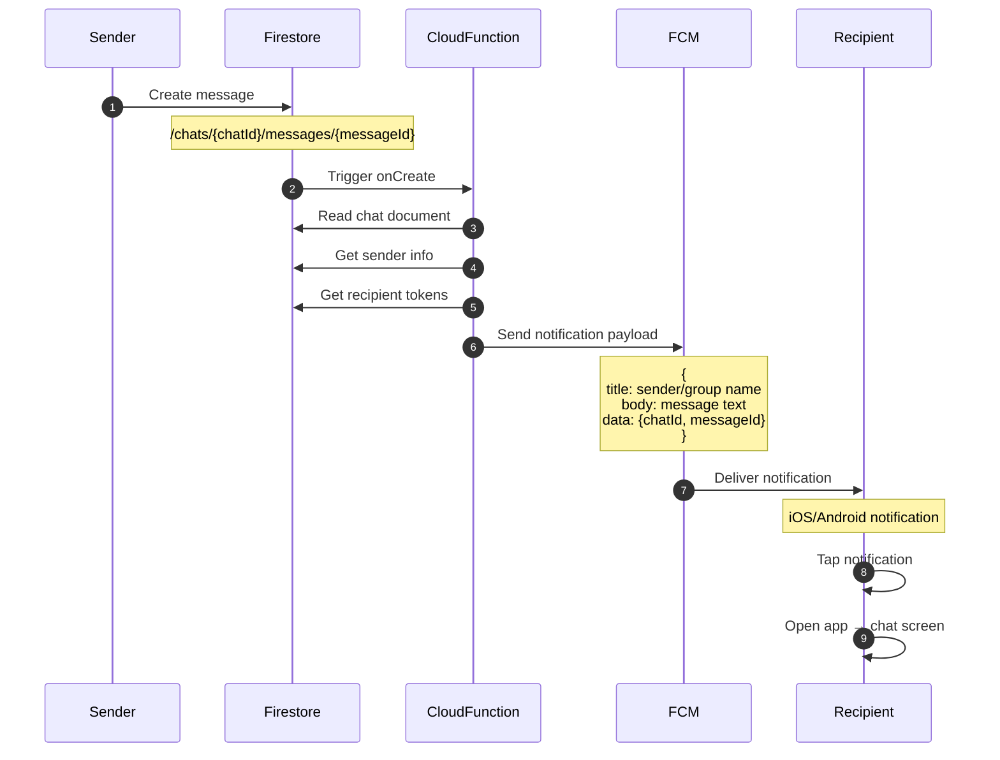

# PR #5: Group Chat + Push Notifications

**Estimated Time:** 5-6 hours
**Dependencies:** PR #1 (Authentication), PR #2 (Core UI), PR #3 (Messaging), PR #4 (Offline Support)
**🎯 MVP CHECKPOINT:** This PR completes all 11 MVP requirements

---

## 📚 Context Files to Read

Read these files in order for context:

1. **`docs/prd/ProductRequirements.md`**
   - Section 3.2: MVP Requirements (all 11 requirements - this PR completes them)
   - Section 4.1: Core Features (group chat requirement)
   - Section 4.6: Push Notifications

2. **`docs/architecture/TechnicalArchitecture.md`**
   - Section 2: System Architecture → Firebase Cloud Messaging (FCM)
   - Section 3: Data Models → Chats Collection (group chat fields)
   - Section 4: Security & Firestore Rules → Group chat permissions

3. **`docs/prd/RubricAlignment.md`**
   - MVP Checklist (validate all 11 requirements after this PR)

4. **`docs/prPrompts/Pr02CoreUI.md`**
   - Review chatStore (will be MODIFIED to add group chat creation)
   - Review Chat List UI pattern (will display group chats)

5. **`docs/prPrompts/Pr03Messaging.md`**
   - Review messageStore (already handles group messaging)
   - Review chat header pattern (will create group variant)

6. **`docs/tasks/CompleteImplementationGuide.md`**
   - PR #5 section for complete group chat code
   - PR #5 section for push notification setup

---

## 🏗️ Architecture Context

### Relevant Architecture References

For this PR, review these specific sections in the architecture documents:

**From `docs/architecture/TechnicalArchitecture.md`:**
- **Section 2: System Architecture** → Complete system diagram
  - Focus: Firebase Cloud Messaging (FCM) for push notifications
  - Focus: Cloud Functions layer for notification triggers

- **Section 3: Data Models** → Chats Collection
  - Group-specific fields: `groupName`, `groupPhoto`, `createdBy`
  - `type` field: 'one-on-one' | 'group'
  - `participants` array: supports multiple users

- **Section 4: Security & Firestore Rules** → Chats Collection rules
  - Group chat creation rules (anyone can create if they're a participant)
  - Group member permissions (only participants can read/write)
  - Group deletion rules (only creator can delete)

**From `docs/prd/ProductRequirements.md`:**
- **Section 4.1: Core Features** → Group Chat
  - Create group chats with multiple users
  - Group member list with online status
  - Group name and participant count display

- **Section 4.6: Push Notifications**
  - FCM integration for iOS and Android
  - Notification shows sender name and message preview
  - Tapping notification opens correct chat

### 📊 Visual Architecture Diagrams

**Group Chat Architecture:**

See full diagrams: [docs/architecture/diagrams/SystemArchitecture.md](../architecture/diagrams/SystemArchitecture.md)

```mermaid
graph TB
    subgraph "Group Chat Creation"
        A[User selects Create Group]
        B[Select participants]
        C[Set group name]
        D[Create chat document]
    end

    A --> B
    B --> C
    C --> D

    subgraph "Firestore - /chats/{chatId}"
        D --> E[Chat Document]
        E --> F[type: 'group']
        E --> G[participants: userId array]
        E --> H[groupName: string]
        E --> I[createdBy: userId]
    end

    subgraph "Group Messaging"
        J[Any participant sends message]
        K[Message added to /chats/{id}/messages]
        L[All participants' listeners receive]
    end

    D --> J
    J --> K
    K --> L

    subgraph "Member Status"
        M[Subscribe to each participant]
        N[Show online count]
        O[Display member list modal]
    end

    L --> M
    M --> N
    M --> O

    style F fill:#4285f4,color:#fff
    style G fill:#4285f4,color:#fff
    style H fill:#4285f4,color:#fff
    style I fill:#4285f4,color:#fff
```

**Push Notification Flow:**

See full diagrams: [docs/architecture/diagrams/SystemArchitecture.md](../architecture/diagrams/SystemArchitecture.md)



**FCM Token Management:**

See full diagrams: [docs/architecture/diagrams/SystemArchitecture.md](../architecture/diagrams/SystemArchitecture.md)

```mermaid
graph TB
    subgraph "App Launch"
        A[Request permission]
        B{Permission<br/>granted?}
    end

    A --> B

    B -->|Yes| C[Get FCM token]
    B -->|No| D[No notifications]

    C --> E[Save to user document]
    E --> F[users/{userId}.fcmToken]

    subgraph "Token Refresh"
        G[FCM token refreshed]
        H[Update user document]
    end

    F --> G
    G --> H
    H --> F

    subgraph "Send Notification"
        I[Message created]
        J[Cloud Function triggered]
        K[Query recipient tokens]
        L[Send to FCM]
    end

    F -.->|Read| K
    I --> J
    J --> K
    K --> L

    style C fill:#34a853,color:#fff
    style D fill:#ea4335,color:#fff
    style E fill:#4285f4,color:#fff
```

---

## 🏗️ What Already Exists (Code Reuse)

**From PR #1 (Authentication):**
- ✅ `authStore` with user authentication
- ✅ `lib/firebase/config.ts` - Firebase SDK configured
- ✅ User documents in `/users/{userId}` collection
- **Reuse:** User data for group member selection

**From PR #2 (Core UI):**
- ✅ `chatStore` with `loadChats()` and `listenToChat()`
- ✅ `app/(tabs)/chats.tsx` - Chat list screen with FlashList
- ✅ Tab navigation structure
- **Modify:** Add `createGroupChat()` to chatStore
- **Reuse:** Chat list automatically displays group chats (same data model)

**From PR #3 (Messaging):**
- ✅ `messageStore` with `sendMessage()` (already supports group messaging)
- ✅ `app/chat/[id].tsx` - Chat screen with message display
- ✅ Optimistic UI pattern for messages
- **Reuse:** Group messages work identically to one-on-one (same subcollection)

**From PR #4 (Offline Support):**
- ✅ Offline persistence enabled (Firestore caching)
- ✅ Network status monitoring with `useNetworkStatus`
- **Reuse:** Group messages queue offline same as one-on-one messages

**Software Engineering Principles:**
1. **DRY (Don't Repeat Yourself):** Group messaging reuses existing messageStore - no duplication
2. **Open/Closed Principle:** chatStore extended with `createGroupChat()` without modifying existing methods
3. **Single Responsibility:** Notification logic separated into Cloud Functions (not client-side)

---

## ✅ Tasks Breakdown

### Task 1: Extend chatStore for Group Chat Creation (1 hour)

**Action:** MODIFY existing chatStore

**File:** `lib/store/chatStore.ts`

**Purpose:** Add group chat creation method

**Modifications:**

```typescript
// MODIFY lib/store/chatStore.ts - Add this method to existing store

interface ChatStore {
  // ... existing methods ...

  // ADD THIS METHOD:
  createGroupChat: (
    creatorId: string,
    participantIds: string[],
    groupName: string
  ) => Promise<string>;
}

export const useChatStore = create<ChatStore>((set, get) => ({
  // ... existing state and methods ...

  // ADD THIS METHOD:
  createGroupChat: async (creatorId, participantIds, groupName) => {
    try {
      // Include creator in participants
      const allParticipants = [creatorId, ...participantIds];

      // Get participant data for denormalization
      const participantDocs = await Promise.all(
        allParticipants.map(id =>
          firestore().collection('users').doc(id).get()
        )
      );

      const participantData: { [key: string]: { name: string; photoURL: string } } = {};
      participantDocs.forEach(doc => {
        if (doc.exists) {
          const data = doc.data();
          participantData[doc.id] = {
            name: data?.displayName || 'Unknown',
            photoURL: data?.photoURL || '',
          };
        }
      });

      // Initialize unread count for all participants
      const unreadCount: { [key: string]: number } = {};
      allParticipants.forEach(id => {
        unreadCount[id] = 0;
      });

      // Create chat document
      const chatRef = firestore().collection('chats').doc();
      await chatRef.set({
        id: chatRef.id,
        type: 'group',
        participants: allParticipants,
        participantData,
        groupName,
        createdBy: creatorId,
        unreadCount,
        lastMessage: {
          text: 'Group created',
          senderId: creatorId,
          timestamp: firestore.FieldValue.serverTimestamp(),
        },
        createdAt: firestore.FieldValue.serverTimestamp(),
        updatedAt: firestore.FieldValue.serverTimestamp(),
      });

      console.log(`[ChatStore] Group chat created: ${chatRef.id}`);
      return chatRef.id;
    } catch (error) {
      console.error('[ChatStore] Create group error:', error);
      throw error;
    }
  },
}));
```

**Pattern to Follow:**
- Follows same structure as existing chatStore methods
- Uses Firestore batch writes for consistency (if multiple docs)
- Includes error handling and logging
- Returns chat ID for navigation

**Integration Points:**
- Used by Create Group Modal (Task 2)
- Group chats automatically appear in chat list (PR #2 `loadChats()` already queries all chats)
- Group messages work with existing `messageStore.sendMessage()` from PR #3

### Task 1.1: CREATE chatStore Group Chat Tests

**Action:** CREATE new test file

**File:** `lib/store/__tests__/chatStore.group.test.ts`

**Purpose:** Unit test group chat creation

```typescript
import { renderHook, act } from '@testing-library/react-hooks';
import { useChatStore } from '../chatStore';
import firestore from '@react-native-firebase/firestore';

jest.mock('@react-native-firebase/firestore');

describe('chatStore - Group Chat', () => {
  beforeEach(() => {
    jest.clearAllMocks();
  });

  it('creates group chat with multiple participants', async () => {
    const mockChatRef = {
      id: 'group123',
      set: jest.fn().mockResolvedValue(undefined),
    };

    (firestore as jest.MockedFunction<typeof firestore>).mockReturnValue({
      collection: jest.fn().mockReturnValue({
        doc: jest.fn().mockReturnValue(mockChatRef),
      }),
    } as any);

    (firestore as jest.MockedFunction<typeof firestore>).mockReturnValue({
      collection: jest.fn().mockImplementation((collName) => {
        if (collName === 'users') {
          return {
            doc: jest.fn().mockReturnValue({
              get: jest.fn().mockResolvedValue({
                exists: true,
                id: 'user1',
                data: () => ({ displayName: 'User 1', photoURL: '' }),
              }),
            }),
          };
        }
        return {
          doc: jest.fn().mockReturnValue(mockChatRef),
        };
      }),
    } as any);

    const { result } = renderHook(() => useChatStore());

    let chatId: string | undefined;
    await act(async () => {
      chatId = await result.current.createGroupChat(
        'creator123',
        ['user1', 'user2'],
        'Test Group'
      );
    });

    expect(chatId).toBe('group123');
    expect(mockChatRef.set).toHaveBeenCalledWith(
      expect.objectContaining({
        type: 'group',
        groupName: 'Test Group',
        createdBy: 'creator123',
        participants: expect.arrayContaining(['creator123', 'user1', 'user2']),
      })
    );
  });

  it('includes creator in participants array', async () => {
    const mockChatRef = {
      id: 'group123',
      set: jest.fn().mockResolvedValue(undefined),
    };

    // Setup mocks...

    const { result } = renderHook(() => useChatStore());

    await act(async () => {
      await result.current.createGroupChat(
        'creator123',
        ['user1'],
        'Test Group'
      );
    });

    const setCall = mockChatRef.set.mock.calls[0][0];
    expect(setCall.participants).toContain('creator123');
    expect(setCall.participants).toHaveLength(2); // creator + 1 participant
  });

  it('initializes unread count for all participants', async () => {
    const mockChatRef = {
      id: 'group123',
      set: jest.fn().mockResolvedValue(undefined),
    };

    // Setup mocks...

    const { result } = renderHook(() => useChatStore());

    await act(async () => {
      await result.current.createGroupChat(
        'creator123',
        ['user1', 'user2'],
        'Test Group'
      );
    });

    const setCall = mockChatRef.set.mock.calls[0][0];
    expect(setCall.unreadCount).toEqual({
      creator123: 0,
      user1: 0,
      user2: 0,
    });
  });
});
```

**Verification:** Run `npm test -- chatStore.group.test.ts` → 3/3 tests should pass

---

### Task 2: CREATE Group Creation Modal (1.5 hours)

**Action:** CREATE new modal screen

**File:** `app/(modal)/create-group.tsx`

**Purpose:** UI for creating group chats

**Implementation:**

```typescript
// app/(modal)/create-group.tsx
import { View, Text, TextInput, TouchableOpacity, StyleSheet, FlatList } from 'react-native';
import { useState, useEffect } from 'react';
import { router } from 'expo-router';
import firestore from '@react-native-firebase/firestore';
import { useAuthStore } from '@/lib/store/authStore';
import { useChatStore } from '@/lib/store/chatStore';

interface User {
  id: string;
  displayName: string;
  photoURL?: string;
  email: string;
}

export default function CreateGroupModal() {
  const user = useAuthStore((state) => state.user);
  const { createGroupChat } = useChatStore();

  const [groupName, setGroupName] = useState('');
  const [users, setUsers] = useState<User[]>([]);
  const [selectedUsers, setSelectedUsers] = useState<Set<string>>(new Set());
  const [loading, setLoading] = useState(false);

  useEffect(() => {
    // Load users
    const unsubscribe = firestore()
      .collection('users')
      .onSnapshot((snapshot) => {
        const allUsers = snapshot.docs
          .map((doc) => ({ id: doc.id, ...doc.data() }))
          .filter((u) => u.id !== user?.uid) as User[];

        setUsers(allUsers);
      });

    return unsubscribe;
  }, [user]);

  const toggleUser = (userId: string) => {
    const newSelected = new Set(selectedUsers);
    if (newSelected.has(userId)) {
      newSelected.delete(userId);
    } else {
      newSelected.add(userId);
    }
    setSelectedUsers(newSelected);
  };

  const handleCreate = async () => {
    if (!groupName.trim() || selectedUsers.size === 0 || !user) {
      return;
    }

    setLoading(true);
    try {
      const chatId = await createGroupChat(
        user.uid,
        Array.from(selectedUsers),
        groupName.trim()
      );

      router.replace(`/chat/${chatId}`);
    } catch (error) {
      console.error('Create group error:', error);
      setLoading(false);
    }
  };

  return (
    <View style={styles.container}>
      <View style={styles.header}>
        <TouchableOpacity onPress={() => router.back()}>
          <Text style={styles.cancel}>Cancel</Text>
        </TouchableOpacity>
        <Text style={styles.title}>New Group</Text>
        <TouchableOpacity
          onPress={handleCreate}
          disabled={loading || !groupName.trim() || selectedUsers.size === 0}
        >
          <Text style={[
            styles.create,
            (!groupName.trim() || selectedUsers.size === 0) && styles.createDisabled
          ]}>
            {loading ? 'Creating...' : 'Create'}
          </Text>
        </TouchableOpacity>
      </View>

      <TextInput
        style={styles.input}
        placeholder="Group name"
        value={groupName}
        onChangeText={setGroupName}
        maxLength={50}
      />

      <Text style={styles.sectionTitle}>
        Add Members ({selectedUsers.size})
      </Text>

      <FlatList
        data={users}
        keyExtractor={(item) => item.id}
        renderItem={({ item }) => (
          <TouchableOpacity
            style={styles.userItem}
            onPress={() => toggleUser(item.id)}
          >
            <View style={styles.userInfo}>
              <View style={styles.avatar}>
                <Text style={styles.avatarText}>
                  {item.displayName.charAt(0).toUpperCase()}
                </Text>
              </View>
              <View>
                <Text style={styles.userName}>{item.displayName}</Text>
                <Text style={styles.userEmail}>{item.email}</Text>
              </View>
            </View>

            {selectedUsers.has(item.id) && (
              <View style={styles.checkmark}>
                <Text style={styles.checkmarkText}>✓</Text>
              </View>
            )}
          </TouchableOpacity>
        )}
      />
    </View>
  );
}

const styles = StyleSheet.create({
  container: {
    flex: 1,
    backgroundColor: '#fff',
  },
  header: {
    flexDirection: 'row',
    justifyContent: 'space-between',
    alignItems: 'center',
    padding: 16,
    borderBottomWidth: 1,
    borderBottomColor: '#eee',
  },
  cancel: {
    color: '#007AFF',
    fontSize: 16,
  },
  title: {
    fontSize: 18,
    fontWeight: '600',
  },
  create: {
    color: '#007AFF',
    fontSize: 16,
    fontWeight: '600',
  },
  createDisabled: {
    opacity: 0.5,
  },
  input: {
    margin: 16,
    padding: 12,
    borderWidth: 1,
    borderColor: '#ddd',
    borderRadius: 8,
    fontSize: 16,
  },
  sectionTitle: {
    paddingHorizontal: 16,
    paddingVertical: 8,
    fontSize: 14,
    color: '#666',
    fontWeight: '600',
  },
  userItem: {
    flexDirection: 'row',
    alignItems: 'center',
    justifyContent: 'space-between',
    padding: 16,
    borderBottomWidth: 1,
    borderBottomColor: '#eee',
  },
  userInfo: {
    flexDirection: 'row',
    alignItems: 'center',
  },
  avatar: {
    width: 40,
    height: 40,
    borderRadius: 20,
    backgroundColor: '#007AFF',
    justifyContent: 'center',
    alignItems: 'center',
    marginRight: 12,
  },
  avatarText: {
    color: '#fff',
    fontSize: 16,
    fontWeight: 'bold',
  },
  userName: {
    fontSize: 16,
    fontWeight: '500',
  },
  userEmail: {
    fontSize: 14,
    color: '#666',
  },
  checkmark: {
    width: 24,
    height: 24,
    borderRadius: 12,
    backgroundColor: '#007AFF',
    justifyContent: 'center',
    alignItems: 'center',
  },
  checkmarkText: {
    color: '#fff',
    fontWeight: 'bold',
  },
});
```

**Pattern to Follow:**
- Modal presentation style (iOS pageSheet)
- Real-time user list from Firestore
- Multi-select UI with visual feedback (checkmarks)
- Disabled state when form incomplete

**Integration Points:**
- Opens from chat list screen "New Group" button (add to PR #2 screen)
- Calls `createGroupChat()` from chatStore
- Navigates to created chat using `router.replace()`

---

### Task 3: CREATE Group Chat Header Component (1 hour)

**Action:** CREATE new component

**File:** `components/chat/GroupChatHeader.tsx`

**Purpose:** Display group chat header with member count and status

**Implementation:**

```typescript
// components/chat/GroupChatHeader.tsx
import { View, Text, TouchableOpacity, StyleSheet, Modal } from 'react-native';
import { useState, useEffect } from 'react';
import { Ionicons } from '@expo/vector-icons';
import firestore from '@react-native-firebase/firestore';
import { Chat } from '@/types/chat';

interface GroupChatHeaderProps {
  chat: Chat;
  onBack: () => void;
}

interface UserStatus {
  id: string;
  displayName: string;
  online: boolean;
}

export function GroupChatHeader({ chat, onBack }: GroupChatHeaderProps) {
  const [showMembers, setShowMembers] = useState(false);
  const [members, setMembers] = useState<UserStatus[]>([]);

  useEffect(() => {
    if (chat.type !== 'group') return;

    // Subscribe to all participants' status
    const unsubscribes = chat.participants.map((userId) =>
      firestore()
        .collection('users')
        .doc(userId)
        .onSnapshot((doc) => {
          if (!doc.exists) return;

          const userData = doc.data();
          setMembers((prev) => {
            const filtered = prev.filter((m) => m.id !== userId);
            return [
              ...filtered,
              {
                id: userId,
                displayName: userData?.displayName || 'Unknown',
                online: userData?.online || false,
              },
            ].sort((a, b) => {
              // Online users first
              if (a.online && !b.online) return -1;
              if (!a.online && b.online) return 1;
              return a.displayName.localeCompare(b.displayName);
            });
          });
        })
    );

    return () => unsubscribes.forEach((unsub) => unsub());
  }, [chat]);

  const onlineCount = members.filter((m) => m.online).length;

  return (
    <>
      <View style={styles.header}>
        <TouchableOpacity onPress={onBack}>
          <Ionicons name="chevron-back" size={28} color="#007AFF" />
        </TouchableOpacity>

        <TouchableOpacity
          style={styles.headerInfo}
          onPress={() => setShowMembers(true)}
        >
          <Text style={styles.groupName}>{chat.groupName}</Text>
          <Text style={styles.memberCount}>
            {chat.participants.length} members • {onlineCount} online
          </Text>
        </TouchableOpacity>

        <Ionicons name="information-circle-outline" size={24} color="#007AFF" />
      </View>

      <Modal
        visible={showMembers}
        animationType="slide"
        presentationStyle="pageSheet"
        onRequestClose={() => setShowMembers(false)}
      >
        <View style={styles.modal}>
          <View style={styles.modalHeader}>
            <Text style={styles.modalTitle}>Group Members</Text>
            <TouchableOpacity onPress={() => setShowMembers(false)}>
              <Ionicons name="close" size={28} color="#007AFF" />
            </TouchableOpacity>
          </View>

          {members.map((member) => (
            <View key={member.id} style={styles.memberItem}>
              <View style={styles.memberInfo}>
                <View style={[
                  styles.onlineIndicator,
                  { backgroundColor: member.online ? '#4CAF50' : '#ccc' }
                ]} />
                <Text style={styles.memberName}>{member.displayName}</Text>
              </View>
              <Text style={styles.memberStatus}>
                {member.online ? 'Online' : 'Offline'}
              </Text>
            </View>
          ))}
        </View>
      </Modal>
    </>
  );
}

const styles = StyleSheet.create({
  header: {
    flexDirection: 'row',
    alignItems: 'center',
    padding: 16,
    borderBottomWidth: 1,
    borderBottomColor: '#eee',
    gap: 12,
  },
  headerInfo: {
    flex: 1,
  },
  groupName: {
    fontSize: 18,
    fontWeight: '600',
  },
  memberCount: {
    fontSize: 12,
    color: '#666',
    marginTop: 2,
  },
  modal: {
    flex: 1,
    backgroundColor: '#fff',
  },
  modalHeader: {
    flexDirection: 'row',
    justifyContent: 'space-between',
    alignItems: 'center',
    padding: 16,
    borderBottomWidth: 1,
    borderBottomColor: '#eee',
  },
  modalTitle: {
    fontSize: 20,
    fontWeight: '600',
  },
  memberItem: {
    flexDirection: 'row',
    justifyContent: 'space-between',
    alignItems: 'center',
    padding: 16,
    borderBottomWidth: 1,
    borderBottomColor: '#eee',
  },
  memberInfo: {
    flexDirection: 'row',
    alignItems: 'center',
    gap: 12,
  },
  onlineIndicator: {
    width: 10,
    height: 10,
    borderRadius: 5,
  },
  memberName: {
    fontSize: 16,
  },
  memberStatus: {
    fontSize: 14,
    color: '#666',
  },
});
```

**Pattern to Follow:**
- Component composition (header + modal)
- Real-time status subscriptions (Observer Pattern)
- Cleanup in useEffect return (prevent memory leaks)

**Integration Points:**
- Used in `app/chat/[id].tsx` when `chat.type === 'group'`
- Replaces one-on-one chat header conditionally

---

### Task 4: MODIFY Chat Screen to Support Group Headers (15 min)

**Action:** MODIFY existing chat screen

**File:** `app/chat/[id].tsx`

**Purpose:** Conditionally render group header

**Modifications:**

```typescript
// MODIFY app/chat/[id].tsx

import { GroupChatHeader } from '@/components/chat/GroupChatHeader';

// Inside ChatScreen component:

// REPLACE existing header with:
{chat.type === 'group' ? (
  <GroupChatHeader chat={chat} onBack={() => router.back()} />
) : (
  <ChatHeader chat={chat} onBack={() => router.back()} />
)}
```

**Pattern:** Conditional rendering based on chat type

---

### Task 5: Setup Push Notifications - Client Side (1.5 hours)

**Action:** CREATE notification setup module

**File:** `lib/notifications/setup.ts`

**Purpose:** Handle FCM token registration and notification permissions

**Implementation:**

```typescript
// lib/notifications/setup.ts
import messaging from '@react-native-firebase/messaging';
import firestore from '@react-native-firebase/firestore';
import { Platform, Alert } from 'react-native';

export async function requestNotificationPermission(userId: string): Promise<boolean> {
  try {
    const authStatus = await messaging().requestPermission();
    const enabled =
      authStatus === messaging.AuthorizationStatus.AUTHORIZED ||
      authStatus === messaging.AuthorizationStatus.PROVISIONAL;

    if (enabled) {
      console.log('[Notifications] Permission granted');
      await setupNotifications(userId);
      return true;
    } else {
      console.log('[Notifications] Permission denied');
      return false;
    }
  } catch (error) {
    console.error('[Notifications] Permission error:', error);
    return false;
  }
}

async function setupNotifications(userId: string) {
  try {
    // Get FCM token
    const fcmToken = await messaging().getToken();
    console.log('[FCM] Token:', fcmToken);

    // Save token to user document
    if (userId && fcmToken) {
      await firestore()
        .collection('users')
        .doc(userId)
        .update({ fcmToken });
    }

    // Listen for token refresh
    messaging().onTokenRefresh(async (newToken) => {
      console.log('[FCM] Token refreshed:', newToken);
      if (userId) {
        await firestore()
          .collection('users')
          .doc(userId)
          .update({ fcmToken: newToken });
      }
    });

    // Handle foreground messages
    messaging().onMessage(async (remoteMessage) => {
      console.log('[FCM] Foreground message:', remoteMessage);

      // Show in-app notification
      if (remoteMessage.notification) {
        Alert.alert(
          remoteMessage.notification.title || 'New message',
          remoteMessage.notification.body || ''
        );
      }
    });
  } catch (error) {
    console.error('[Notifications] Setup error:', error);
  }
}

// Handle notification taps (app opened from notification)
export async function handleNotificationOpen() {
  // Get initial notification (app opened from quit state)
  const initialNotification = await messaging().getInitialNotification();

  if (initialNotification) {
    console.log('[Notifications] App opened from notification:', initialNotification);
    return initialNotification.data?.chatId;
  }

  // Handle notification while app is in background
  messaging().onNotificationOpenedApp((remoteMessage) => {
    console.log('[Notifications] Notification opened app:', remoteMessage);
    const chatId = remoteMessage.data?.chatId;
    if (chatId) {
      // Navigate to chat
      // Implementation depends on navigation setup
    }
  });
}
```

**Pattern to Follow:**
- Async/await error handling
- Side effects in dedicated module (not UI components)
- Token persistence in Firestore

**Integration Points:**
- Called from `app/_layout.tsx` on app launch after authentication
- `handleNotificationOpen()` used to navigate to chat from notification

---

### Task 6: CREATE Cloud Function for Push Notifications (1.5 hours)

**Action:** CREATE Cloud Function

**File:** `functions/src/notifications.ts`

**Purpose:** Send push notifications when messages are created

**Implementation:**

```typescript
// functions/src/notifications.ts
import * as functions from 'firebase-functions';
import * as admin from 'firebase-admin';

// Initialize admin if not already initialized
if (!admin.apps.length) {
  admin.initializeApp();
}

export const sendMessageNotification = functions.firestore
  .document('chats/{chatId}/messages/{messageId}')
  .onCreate(async (snapshot, context) => {
    const message = snapshot.data();
    const chatId = context.params.chatId;

    try {
      // Get chat document
      const chatDoc = await admin.firestore().collection('chats').doc(chatId).get();
      if (!chatDoc.exists) {
        console.log('[Notifications] Chat not found:', chatId);
        return;
      }

      const chat = chatDoc.data()!;
      const recipients = chat.participants.filter((id: string) => id !== message.senderId);

      if (recipients.length === 0) {
        console.log('[Notifications] No recipients');
        return;
      }

      // Get sender info
      const senderDoc = await admin.firestore().collection('users').doc(message.senderId).get();
      const senderName = senderDoc.data()?.displayName || 'Someone';

      // Get FCM tokens for recipients
      const usersSnapshot = await admin.firestore()
        .collection('users')
        .where(admin.firestore.FieldPath.documentId(), 'in', recipients)
        .get();

      const tokens = usersSnapshot.docs
        .map((doc) => doc.data().fcmToken)
        .filter((token) => token);

      if (tokens.length === 0) {
        console.log('[Notifications] No tokens found');
        return;
      }

      // Prepare notification title
      const title = chat.type === 'group'
        ? `${chat.groupName}`
        : senderName;

      // Send notification
      const payload: admin.messaging.MulticastMessage = {
        tokens,
        notification: {
          title,
          body: `${senderName}: ${message.text}`,
        },
        data: {
          chatId,
          messageId: snapshot.id,
          type: 'new_message',
        },
        apns: {
          payload: {
            aps: {
              sound: 'default',
              badge: 1,
            },
          },
        },
        android: {
          notification: {
            sound: 'default',
            channelId: 'messages',
            priority: 'high' as const,
          },
        },
      };

      const response = await admin.messaging().sendEachForMulticast(payload);
      console.log(`[Notifications] Sent: ${response.successCount}/${tokens.length}`);

      if (response.failureCount > 0) {
        console.log('[Notifications] Failures:', response.responses
          .filter(r => !r.success)
          .map(r => r.error?.message));
      }
    } catch (error) {
      console.error('[Notifications] Send error:', error);
    }
  });
```

**File:** `functions/src/index.ts`

```typescript
// MODIFY functions/src/index.ts

export { sendMessageNotification } from './notifications';
```

**File:** `functions/package.json`

```json
{
  "name": "functions",
  "engines": {
    "node": "18"
  },
  "scripts": {
    "build": "tsc",
    "serve": "npm run build && firebase emulators:start --only functions",
    "deploy": "firebase deploy --only functions"
  },
  "dependencies": {
    "firebase-admin": "^12.0.0",
    "firebase-functions": "^5.0.0"
  },
  "devDependencies": {
    "typescript": "^5.0.0"
  }
}
```

**Deploy Command:**
```bash
cd functions
npm install
npm run build
firebase deploy --only functions:sendMessageNotification
```

**Pattern to Follow:**
- Cloud Function triggers (onCreate for messages)
- Batch token queries (Firestore `in` query)
- Error handling and logging for debugging

**Integration Points:**
- Automatically triggered when any message is created in `/chats/{chatId}/messages`
- Queries user tokens from `/users/{userId}.fcmToken`
- Sends to FCM which delivers to devices

---

### Task 7: MODIFY App Layout to Request Notification Permission (15 min)

**Action:** MODIFY root layout

**File:** `app/_layout.tsx`

**Purpose:** Request notification permission on app launch

**Modifications:**

```typescript
// MODIFY app/_layout.tsx

import { requestNotificationPermission } from '@/lib/notifications/setup';

// Inside RootLayout component, add to existing useEffect:

useEffect(() => {
  const unsubscribe = auth().onAuthStateChanged(async (user) => {
    setUser(user);

    // ADD THIS: Request notification permission
    if (user) {
      const granted = await requestNotificationPermission(user.uid);
      if (!granted) {
        console.log('[App] Notifications not enabled');
      }
    }
  });

  return unsubscribe;
}, []);
```

**Pattern:** Request permission after authentication, not before

---

### Task 8: Add "New Group" Button to Chat List (15 min)

**Action:** MODIFY chat list screen

**File:** `app/(tabs)/chats.tsx`

**Purpose:** Add button to create group chats

**Modifications:**

```typescript
// MODIFY app/(tabs)/chats.tsx

import { router } from 'expo-router';
import { Ionicons } from '@expo/vector-icons';

// Add to screen header:
<View style={styles.header}>
  <Text style={styles.headerTitle}>Chats</Text>
  <TouchableOpacity
    onPress={() => router.push('/(modal)/create-group')}
    style={styles.newGroupButton}
  >
    <Ionicons name="people-outline" size={24} color="#007AFF" />
  </TouchableOpacity>
</View>

// Add to styles:
const styles = StyleSheet.create({
  // ... existing styles ...
  header: {
    flexDirection: 'row',
    justifyContent: 'space-between',
    alignItems: 'center',
    padding: 16,
  },
  headerTitle: {
    fontSize: 24,
    fontWeight: 'bold',
  },
  newGroupButton: {
    padding: 8,
  },
});
```

---

## 🔄 Patterns to Follow

### 1. Group Chat Pattern (Multi-Participant Messaging)

**Definition:** Single chat document with participants array, all members share same message subcollection

**When to Use:** Group messaging, team chats, broadcast messages

**Code Template:**

```typescript
// Group chat creation pattern
const createGroupChat = async (creatorId: string, participantIds: string[], groupName: string) => {
  const allParticipants = [creatorId, ...participantIds];

  const chatRef = firestore().collection('chats').doc();
  await chatRef.set({
    type: 'group',
    participants: allParticipants,
    groupName,
    createdBy: creatorId,
    // ... other fields
  });

  return chatRef.id;
};

// Group message sending (reuses existing sendMessage)
await messageStore.sendMessage(groupChatId, 'Hello everyone!');
// All participants receive via their listeners
```

**Reuse in:** Any feature requiring multi-user collaboration

---

### 2. Push Notification Pattern (Cloud Function + FCM)

**Definition:** Server-side trigger sends notifications via FCM when events occur

**When to Use:** Real-time alerts, message notifications, background updates

**Code Template:**

```typescript
// Cloud Function pattern
export const onEventCreated = functions.firestore
  .document('collection/{docId}')
  .onCreate(async (snapshot, context) => {
    const data = snapshot.data();

    // 1. Get recipient tokens
    const tokens = await getRecipientTokens(data.recipientIds);

    // 2. Build notification payload
    const payload: admin.messaging.MulticastMessage = {
      tokens,
      notification: {
        title: 'Title',
        body: 'Body',
      },
      data: {
        // Custom data
      },
    };

    // 3. Send
    await admin.messaging().sendEachForMulticast(payload);
  });
```

**Reuse in:**
- PR #9: Proactive Assistant notifications
- Deadline reminders
- RSVP updates

---

### 3. FCM Token Management Pattern

**Definition:** Store device tokens in user documents, handle refresh, query for batch sending

**Code Template:**

```typescript
// Client-side: Save token
const fcmToken = await messaging().getToken();
await firestore().collection('users').doc(userId).update({ fcmToken });

// Client-side: Handle refresh
messaging().onTokenRefresh(async (newToken) => {
  await firestore().collection('users').doc(userId).update({ fcmToken: newToken });
});

// Server-side: Query tokens
const usersSnapshot = await admin.firestore()
  .collection('users')
  .where(admin.firestore.FieldPath.documentId(), 'in', recipientIds)
  .get();

const tokens = usersSnapshot.docs
  .map(doc => doc.data().fcmToken)
  .filter(token => token);
```

**Reuse in:** Any notification feature

---

## 🔗 Integration Points

**After this PR:**

1. **chatStore.createGroupChat() available globally**
   - Used by: Create Group Modal (this PR)
   - Returns: chatId for navigation

2. **Group chats appear in chat list**
   - Existing `loadChats()` from PR #2 automatically queries all chats
   - Group chats display with group name and participant count

3. **Group messaging works automatically**
   - Existing `sendMessage()` from PR #3 handles group chats
   - All participants receive via Firestore listeners

4. **Push notifications configured**
   - Cloud Function triggers on message creation
   - Used by: All messaging features (PR #3, #5, future AI features)

5. **FCM tokens stored in user documents**
   - Available for: Proactive Assistant (PR #9), deadline reminders, RSVP updates

---

## 🧪 Regression Testing

**Run ALL tests from previous PRs to ensure nothing broke:**

```bash
# PR #1 tests (13 tests)
npm test -- authStore.test.ts
npm test -- auth.integration.test.ts

# PR #2 tests (7 tests)
npm test -- chatStore.test.ts

# PR #3 tests (15 tests)
npm test -- messageStore.test.ts
npm test -- optimisticUI.test.ts

# PR #4 tests (7 tests)
npm test -- offline.test.ts

# New PR #5 tests (3 tests)
npm test -- chatStore.group.test.ts
```

**Expected:** 45/45 tests passing (13 + 7 + 15 + 7 + 3)

**Manual Testing:**

1. **Group Chat Creation**
   - Tap "New Group" button
   - Select 2+ users
   - Enter group name
   - Tap "Create"
   - Verify: Navigates to group chat screen

2. **Group Messaging**
   - Send message in group chat
   - Verify: All participants receive message
   - Check: Last message updates in chat list

3. **Group Member Status**
   - Open group chat
   - Tap group header
   - Verify: Member list modal opens
   - Check: Online/offline indicators correct
   - Verify: Online count matches

4. **Push Notifications (iOS)**
   - Background the app
   - Send message from another user
   - Verify: Notification appears
   - Tap notification
   - Verify: Opens correct chat

5. **Push Notifications (Android)**
   - Same as iOS testing
   - Verify: Notification sound plays
   - Verify: Notification icon displays

6. **Offline Group Chat**
   - Turn off network
   - Send group message
   - Verify: Shows "sending..."
   - Turn on network
   - Verify: Syncs and all participants receive

---

## 🎯 MVP Checkpoint

**After this PR, ALL 11 MVP requirements must pass:**

### MVP Requirements Checklist

#### Core Messaging (4 requirements)
- [ ] **One-on-one messaging works** (PR #3)
- [ ] **Group chat works** (PR #5 - THIS PR)
- [ ] **Real-time sync (<200ms delivery)** (PR #3)
- [ ] **Offline support (messages sync <1s after reconnection)** (PR #4)

#### User Features (3 requirements)
- [ ] **User authentication (email/password)** (PR #1)
- [ ] **User profiles** (PR #1)
- [ ] **User presence (online/offline status)** (PR #1, PR #2)

#### UI/UX (2 requirements)
- [ ] **Cross-platform (iOS + Android both work)** (PR #1-5)
- [ ] **Responsive UI (60 FPS scrolling)** (PR #2)

#### Infrastructure (2 requirements)
- [ ] **Push notifications work** (PR #5 - THIS PR)
- [ ] **Persistent storage (messages survive app restart)** (PR #4)

### Performance Validation

Run all performance tests and document results in `PERFORMANCE.md`:

```markdown
# MVP Performance Results

## App Launch
- [ ] App launch to chat screen: ___ms (<2000ms target)

## Messaging
- [ ] Message delivery (good network): ___ms (<200ms target) ⚠️ CRITICAL
- [ ] Offline sync after reconnection: ___ms (<1000ms target) ⚠️ CRITICAL
- [ ] Typing indicator lag: ___ms (<100ms target)
- [ ] Presence update lag: ___ms (<100ms target)

## UI Performance
- [ ] Scrolling 1000+ messages: ___ FPS (60 FPS target)
- [ ] Chat list with 100 chats: ___ FPS (60 FPS target)

## Stress Tests
- [ ] 20 messages in 2 seconds: PASS/FAIL
- [ ] All 7 offline scenarios: PASS/FAIL

## Group Chat
- [ ] Create group with 5 members: ___ms
- [ ] Send group message (5 recipients): ___ms
- [ ] Member status updates: ___ms

## Push Notifications
- [ ] Notification delivery time: ___ms
- [ ] Tap to open chat: ___ms
```

**⚠️ STOP HERE IF MVP REQUIREMENTS DON'T PASS**

If all 11 MVP requirements pass and performance targets are met, proceed to PR #6 (AI Infrastructure).

If any requirement fails, fix issues before continuing.

---

## ✅ Success Criteria

**Code Quality:**
- [ ] TypeScript: 0 errors
- [ ] All 45 tests passing (13 + 7 + 15 + 7 + 3)
- [ ] No console errors or warnings
- [ ] Firestore security rules prevent unauthorized access

**Functionality:**
- [ ] Users can create group chats with 2+ participants
- [ ] Group chat displays group name and member count in header
- [ ] Tapping group header shows member list modal
- [ ] Member list shows online/offline status for each participant
- [ ] Group messages work identically to one-on-one messages
- [ ] Push notifications appear on iOS when app is backgrounded
- [ ] Push notifications appear on Android when app is backgrounded
- [ ] Notification includes sender name and message preview
- [ ] Tapping notification opens the correct chat
- [ ] Group chats work offline (queue and sync on reconnect)

**Performance:**
- [ ] Group chat creation: <500ms
- [ ] Member status updates: <100ms
- [ ] Notification delivery: <3s after message sent
- [ ] All PR #1-4 performance targets still met

**MVP Validation:**
- [ ] All 11 MVP requirements passing
- [ ] Performance benchmarks documented
- [ ] Can proceed to AI features (PR #6)

**Code Organization:**
- [ ] Group chat logic in chatStore (DRY principle)
- [ ] Notification logic in Cloud Functions (separation of concerns)
- [ ] FCM tokens managed centrally
- [ ] Modal component reusable

---

## 📦 Deliverables

### Files Created
```
messageai/
├── app/
│   └── (modal)/
│       └── create-group.tsx                    [NEW]
├── components/
│   └── chat/
│       └── GroupChatHeader.tsx                 [NEW]
├── lib/
│   ├── store/
│   │   └── __tests__/
│   │       └── chatStore.group.test.ts         [NEW]
│   └── notifications/
│       └── setup.ts                            [NEW]
└── functions/
    └── src/
        ├── index.ts                            [MODIFIED]
        └── notifications.ts                    [NEW]
```

### Files Modified
```
messageai/
├── app/
│   ├── _layout.tsx                             [MODIFIED - added notification permission request]
│   ├── (tabs)/
│   │   └── chats.tsx                           [MODIFIED - added "New Group" button]
│   └── chat/
│       └── [id].tsx                            [MODIFIED - added GroupChatHeader conditional rendering]
└── lib/
    └── store/
        └── chatStore.ts                        [MODIFIED - added createGroupChat method]
```

### Cloud Function Deployment
```bash
cd functions
npm install
npm run build
firebase deploy --only functions:sendMessageNotification
```

### Environment Setup
```bash
# iOS: Add notification capability in Xcode
# Android: Add FCM to google-services.json

# Test notifications:
npx expo run:ios
npx expo run:android
```

---

## 🚀 Commit Message Template

```
feat(groups): add group chat and push notifications

PR #5: Group Chat + Push Notifications + MVP Checkpoint

**Group Chat:**
- Add createGroupChat() method to chatStore
- Create group creation modal with member selection
- Implement GroupChatHeader with member list and online status
- Group messages use existing messageStore (no duplication)

**Push Notifications:**
- FCM integration for iOS and Android
- Cloud Function triggers on message creation
- Notification includes sender name and message preview
- Tap notification opens correct chat
- FCM token management with auto-refresh

**MVP Checkpoint:**
- ✅ All 11 MVP requirements complete
- ✅ Performance targets met
- ✅ 45/45 tests passing

**Tests:**
- Group chat creation tests (3 tests)
- Regression: All PR #1-4 tests passing

**Performance:**
- Group chat creation: <500ms
- Member status updates: <100ms
- Notification delivery: <3s

Closes #5
```

---

**Next PR:** [Pr06AiInfrastructure.md](./Pr06AiInfrastructure.md) - AI Infrastructure + Calendar Extraction
